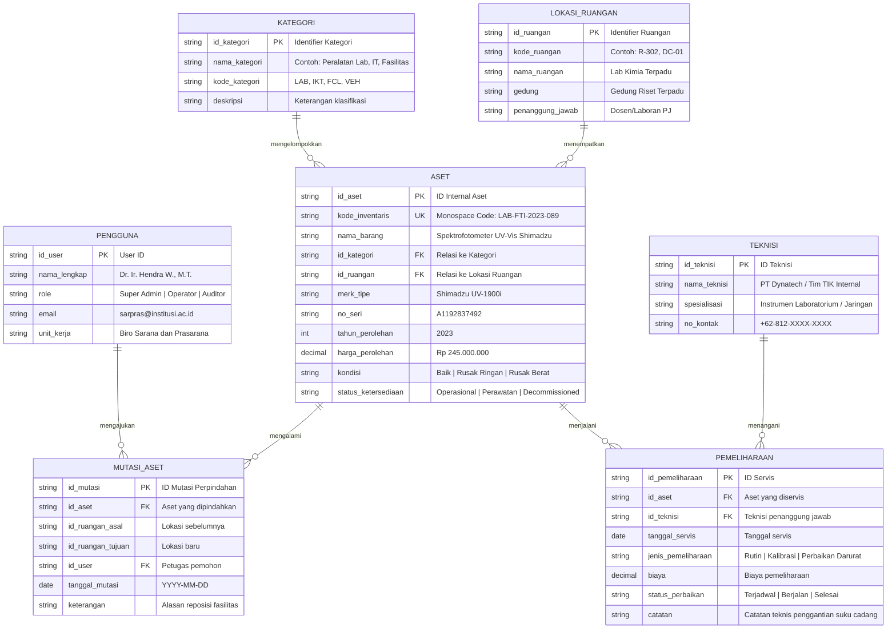
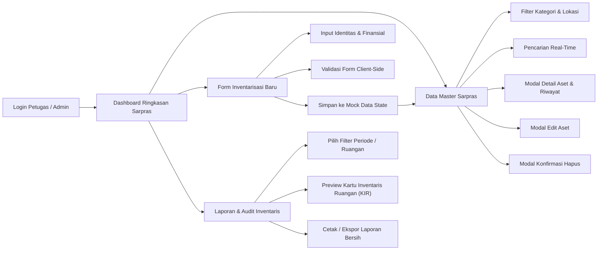

# DOKUMEN PERANCANGAN SISTEM INFORMASI (MILESTONE 1)
## SISTEM MANAJEMEN SARANA DAN PRASARANA (SARPRAS ASSET MANAGEMENT)

---

- **Mata Kuliah:** Pemrograman Web 2 (Client-Side Programming)
- **Topik Sistem:** Sistem Manajemen Sarana dan Prasarana (Asset Management)
- **Bobot Tugas:** Tugas Ke-1 (Project-Based Learning)
- **Milestone:** Milestone 1 (Pekan Ke-3) — Perencanaan Menu (.md) & UI Wireframing (Stitch / Figma)
- **Tema Visual:** Modern Glassmorphism (Dark Obsidian & Frosted Translucent Glass)
- **Arsitektur Antarmuka:** Client-Side Single Page Architecture (No-Backend / Mock Data State)

---

## 1. Deskripsi & Ruang Lingkup Sistem

Sistem Informasi Manajemen Sarana dan Prasarana (**SARPRAS**) adalah platform berbasis web *client-side* yang dirancang untuk mengelola siklus hidup aset institusi (peralatan laboratorium, fasilitas ruang kuliah, perangkat teknologi informasi & server, mesin operasional, serta kendaraan dinas). 

Sistem ini berfokus pada:
1. **Visibilitas Inventaris Real-Time:** Memetakan seluruh barang milik institusi lengkap dengan kode inventaris unik, spesifikasi teknis, kondisi kelayakan, lokasi ruangan, dan nilai buku depresiasi.
2. **Jadwal Pemeliharaan & Kalibrasi Berkala:** Memantau aset yang memerlukan servis berkala guna mencegah *downtime* fasilitas akademik/operasional.
3. **Pencatatan Mutasi & Decommissioning:** Melacak perpindahan fisik aset antar-gedung/ruangan serta prosedur penghapusan aset rusak berat sesuai berita acara formal.

---

## 2. Hirarki Menu & Arsitektur Navigasi (Sidebar / Navbar)

Navigasi sistem mengusung struktur hirarki tetap (*persistent sidebar rail*) pada desktop yang dapat disusutkan (*collapsible drawer*) pada perangkat bergerak.

```
SARPRAS ADMIN PANEL
├── 1.0 Dashboard Eksekutif
│   ├── 1.1 KPI Metrics Ribbon (Total Aset, Kondisi Baik, Perlu Servis, Nilai Buku)
│   ├── 1.2 Grafik Distribusi Kategori Sarpras
│   ├── 1.3 Utilisasi Kapasitas Gedung & Fasilitas
│   └── 1.4 Notifikasi Jadwal Pemeliharaan Terdekat
│
├── 2.0 Master Data Sarana & Prasarana
│   ├── 2.1 Katalog Inventaris Aset (Tabel Data Terpusat)
│   ├── 2.2 Filter Multi-Parameter (Kategori, Gedung, Kondisi, Tahun Perolehan)
│   ├── 2.3 Pencarian Cepat Real-time (Kode Aset, Nama, Nomor Seri)
│   ├── 2.4 Modal Detail Spesifikasi Aset
│   ├── 2.5 Modal Edit/Update Data Sarpras
│   └── 2.6 Modal Konfirmasi Decommissioning / Hapus Aset
│
├── 3.0 Form Inventarisasi Aset Baru
│   ├── 3.1 Identitas Aset (Kode BMN/Inventaris, Nama, Merk/Tipe, Nomor Seri)
│   ├── 3.2 Klasifikasi & Lokasi (Kategori, Gedung, Ruangan, Penanggung Jawab)
│   ├── 3.3 Data Perolehan & Finansial (Tahun, Harga Perolehan, Masa Manfaat)
│   ├── 3.4 Validasi Input Client-Side (Error & Success state feedback)
│   └── 3.5 Generator QR Code / Barcode Tag Preview
│
├── 4.0 Laporan & Audit Inventaris
│   ├── 4.1 Kartu Inventaris Ruangan (KIR) Print-Ready View
│   ├── 4.2 Laporan Kondisi & Kelayakan Aset
│   ├── 4.3 Rekapitulasi Berita Acara Pemeliharaan & Kalibrasi
│   └── 4.4 Fitur Ekspor Data (PDF Print Preview, CSV, XLSX)
│
├── 5.0 Ruangan & Gedung (Fasilitas Fisik)
│   ├── 5.1 Daftar Gedung Kampus
│   └── 5.2 Alokasi Penempatan Aset per Ruang
│
└── 6.0 Pengaturan & Utilitas Sistem
    ├── 6.1 Manajemen Profil Admin
    ├── 6.2 Konfigurasi Cadangan Mock Data (Local Storage / JSON)
    └── 6.3 Panduan SOP Audit Sarpras
```

### Matriks Hak Akses Pengguna (Role-Based Access)

| Modul / Menu | Super Admin (Kepala Biro Sarpras) | Staf Inventaris (Operator) | Teknisi Fasilitas (Maintenance) |
|---|---|---|---|
| Dashboard Eksekutif | Akses Penuh (Full Analytics) | Akses Ringkasan Data | Ringkasan Servis Saja |
| Master Data Sarpras | Lihat, Tambah, Edit, Hapus | Lihat, Tambah, Edit | Lihat Status & Kondisi |
| Form Inventarisasi | Akses Penuh + Otorisasi | Akses Input Data Baru | Read-Only |
| Laporan & Cetak KIR | Akses Semua Format Cetak | Cetak KIR & Label Barcode | Cetak Lembar Servis |
| Modal Hapus / Afkir | Otorisasi Penghapusan | Ajukan Usulan Hapus | Tidak Memiliki Akses |

---

## 3. Konsep ER-D (Entity Relationship Diagram)

ER-D memodelkan struktur data logis relasional yang diadopsi oleh struktur *Mock Data Object* pada sisi *client-side* (JavaScript).



---

## 4. User Flow Antarmuka Admin Panel

Alur interaksi pengguna dirancang efisien dan minim friksi, menghubungkan dashboard analitik dengan pengelolaan master data serta aksi CRUD.



---

## 5. Design System Awal (Visual Guidelines & UI Tokens)

### 5.1 Tema Visual: Modern Glassmorphism

Sesuai dengan ketentuan tugas yang mewajibkan penerapan salah satu estetika industri (Material Design, Glassmorphism, Skeuomorphism, Neumorphism), proyek ini mengimplementasikan **Modern Glassmorphism**.

Ciri khas arsitektur visual ini meliputi:
1. **Kanvas Obsidian Gelap:** Latar belakang solid `#0B0F19` yang memberikan kontras maksimal dan kenyamanan mata bagi staf back-office (*eye ergonomics*).
2. **Panel Kaca Buram (Frosted Glass Substrate):** Kontainer kartu dan sidebar menggunakan warna translucent `rgba(17, 24, 39, 0.75)` dengan efek filter optik `backdrop-filter: blur(16px) saturate(180%)`.
3. **Refleksi Garis Batas Sub-Pixel (Specular Borders):** Pembatas kartu dan elemen interaktif menggunakan garis 1px bergradasi lembut `rgba(255, 255, 255, 0.08)` menggantikan bayangan gelap tebal (*heavy drop shadows*).
4. **Zero Emojis:** Menghilangkan seluruh penggunaan emoji informal. Seluruh status, navigasi, dan indikator menggunakan ikonografi SVG presisi tinggi (*stroke 1.5px*).

### 5.2 Color Palette Tokens

| Token Name | Nilai HEX / RGBA | Peran Fungsional & Penerapan |
|---|---|---|
| **Canvas Obsidian** | `#0B0F19` | Latar belakang dasar antarmuka (Root canvas) |
| **Surface Frosted Glass** | `rgba(17, 24, 39, 0.75)` | Kartu metrik, panel tabel, sidebar rail |
| **Surface Elevate** | `rgba(30, 41, 59, 0.85)` | Dialog modal, dropdown popover, menu konteks |
| **Border Specular** | `rgba(255, 255, 255, 0.08)` | Garis batas struktural panel kaca buram |
| **Text High Contrast** | `#F8FAFC` | Tipografi judul, angka metrik utama, nama barang |
| **Text Muted Steel** | `#94A3B8` | Label input, teks deskripsi, header tabel, metadata |
| **Accent Cyan** | `#0284C7` | Tombol aksi utama (CTA), link navigasi aktif, focus ring |
| **Status Emerald (Baik)** | `#10B981` | Indikator kondisi aset baik & siap pakai |
| **Status Amber (Perlu Servis)** | `#F59E0B` | Indikator kondisi rusak ringan & jadwal pemeliharaan |
| **Status Rose (Rusak Berat)** | `#EF4444` | Indikator kondisi kritis & usulan penghapusan aset |

### 5.3 Typography Architecture

- **Primary Sans-Serif (UI & Headings):** `Plus Jakarta Sans` / `Inter`.
  - Display Title: 32px – 36px, Bold, Letter-spacing -0.02em.
  - Section Header: 18px – 20px, Semi-Bold, Letter-spacing -0.015em.
  - Body Text: 13px – 14px, Regular & Medium, Line-height 1.5.
- **Monospace Engine (Identifiers & Numeric):** `JetBrains Mono` / `Space Mono`.
  - Digunakan untuk: Kode Inventaris Barang (contoh: `LAB-FTI-2023-089`), nomor seri manufaktur, dan nominal valuasi uang (contoh: `Rp 245.000.000`). Memberikan keterbacaan data instan bagi staf audit.

### 5.4 Spesifikasi Komponen Reusable

1. **Button Primitives:**
   - **Primary Action:** Latar belakang solid `#0284C7`, teks putih tebal, radius 8px, efek kilau halus saat hover (`0 0 12px rgba(2,132,199,0.35)`).
   - **Secondary Glass:** Latar belakang transparan `rgba(30, 41, 59, 0.65)`, batas 1px `rgba(255, 255, 255, 0.12)`, teks `#F8FAFC`.
   - **Danger Button:** Latar belakang `#EF4444`, teks putih, digunakan khusus pada dialog modal konfirmasi hapus/afkir.
2. **Form Input Primitives:**
   - Permukaan input gelap matte `rgba(15, 23, 42, 0.75)`, batas 1px `rgba(255, 255, 255, 0.12)`.
   - Label tegas diletakkan di atas kolom input (*label-above pattern*), disertai pesan validasi error di bawah input jika terjadi kesalahan input client-side.
3. **Status Badges (Pills):**
   - Menggunakan format *pill rounded-full* dengan *pulsing indicator dot* (6px):
     - Baik: `bg-emerald-500/10 text-emerald-400 border-emerald-500/30`
     - Rusak Ringan: `bg-amber-500/10 text-amber-400 border-amber-500/30`
     - Rusak Berat: `bg-rose-500/10 text-rose-400 border-rose-500/30`
4. **Modal Konfirmasi Interaktif:**
   - Layer pelindung layar penuh (`rgba(11, 15, 25, 0.8)` + `backdrop-filter: blur(8px)`).
   - Kartu dialog dengan penegasan identitas aset yang akan dihapus, formulir catatan alasan penghapusan, dan klausul persetujuan berita acara.

---

## 6. Hasil Wireframing & Prototyping (Google Stitch & Figma)

Dalam memenuhi instruksi Milestone 1, perancangan antarmuka telah dibuat pada **Google Stitch** (untuk perancangan tata letak cepat & *semantic layouting*) dan **Figma / FigJam** (untuk *Design System Tokens*, *Mermaid ER-D*, dan *High-Fidelity UI Screens*).

### 6.1 Link Publik Project Figma & FigJam

| Media Perancangan | Tipe Berkas | Tautan Akses Publik |
|---|---|---|
| **Figma High-Fidelity UI Design & Design System** | Figma Design File (.fig) | [Buka Proyek Figma SARPRAS High-Fi UI](https://www.figma.com/design/2AFWN3pMNSClSdg1beB2za) |
| **FigJam Diagram (ER-D & User Flow Mermaid)** | FigJam Board File | [Buka FigJam Board ERD & User Flow](https://www.figma.com/board/KZoXT7K9wnRKsp91X45Gpu) |

### 6.2 Identitas Proyek Google Stitch

- **Stitch Project Name:** `projects/3279874328774814817`
- **Judul Proyek:** *SARPRAS - Sistem Manajemen Sarana dan Prasarana*
- **Design System Uploaded:** `Obsidian Glass SARPRAS Design System (DESIGN.md)`

---

### 6.3 Tangkapan Layar (Screenshots) Hasil Rancangan Stitch

#### A. Wireframe & High-Fi Halaman 1: Executive Dashboard (SARPRAS ACADEMIA)
*Menampilkan 4 kartu ringkasan KPI (Total Aset 1.482 unit, Kondisi Baik 86.4%, Perlu Servis 142 unit, Valuasi Rp 4.85 M), panel grafik distribusi kategori sarpras, pemantauan utilisasi gedung, dan tabel jadwal pemeliharaan berkala.*


- **Tautan Langsung Gambar Resolusi Penuh:**  
  [Lihat Tangkapan Layar Dashboard High-Res (Google Storage CDN)](https://lh3.googleusercontent.com/aida/AEtjO1URMBRA1jSiiT5X5gCZYwx1lDnH8l03GIvFiTk9u-I9uRpiVOHvZBvsbL-Vq7l-61PD9yMnR7PwrSQtfyc2GW6yM0NEg7iP0el2E4Tf5t8c6vfyLgjsVxWQEmKg5JUi4RudYYe-RbgAgsBFZUHTuYOyokQIN0taMoIRJk_0Th4j4LQ3L13_J3uTFwBuTniL7sIRQSsg_iH3BO8NBj-Savm8CUGOIoFFgq-1bX48fM1e6Fa_N_K2IJx2oA)

---

#### B. Wireframe & High-Fi Halaman 2: Master Data Sarana dan Prasarana (Tabel Inventaris)
*Menampilkan toolbar filter pencarian multi-kriteria, tabel inventaris komprehensif dengan status kondisi aset berkode warna, seleksi baris batch, tombol aksi (Detail, Edit, Hapus), paginasi data, serta komponen Modal Konfirmasi Penghapusan Aset BMN.*


- **Tautan Langsung Gambar Resolusi Penuh:**  
  [Lihat Tangkapan Layar Data Master High-Res (Google Storage CDN)](https://lh3.googleusercontent.com/aida/AEtjO1Xlq2LwZmvtF1z7WnpKhewoauPHIxNKu_f00VY2JPueflkH7B4tf-Sx8v1rh0cW00hYGrbJueWB-bjyS2AVKqS8XeMTrGbMPbFBr0w7T_gUf6OUN7XRWHiQYDkXYrg5HsZwXOaETNKxg5Pe_v6ryzue3Y9nU1zLTwTqqPwU325ycTkDJG8wwB64DnhI2u4aILOU8XlcITchuzK6Y-lnSd9-D5lG0oDp7GQhxoeHRz-EdqnZijJ7giQb7Ls)

---

## 7. Struktur Folder Proyek

Sesuai dengan ketentuan format pengumpulan tugas mata kuliah Pemrograman Web 2:

```
Tugas Pemweb II/
├── docs/
│   └── perancangan.md          <-- Dokumen Perancangan Milestone 1
├── assets/
│   ├── css/                    <-- Stylesheet Glassmorphism (Milestone 2)
│   ├── js/                     <-- Interaktivitas DOM & Mock Data Store (Milestone 3)
│   └── img/                    <-- Aset Visual & Tangkapan Layar Wireframe
│       ├── stitch_dashboard.png
│       └── stitch_datamaster.png
├── pages/                      <-- Halaman Spesifik Admin Panel (Milestone 3)
│   ├── dashboard.html
│   ├── data-master.html
│   ├── form.html
│   └── laporan.html
├── layout.html                 <-- Master/Template Dasar Layouting (Milestone 2)
├── index.html                  <-- Halaman Utama / Login Admin
└── README.md                   <-- Ringkasan Repositori & Petunjuk Penggunaan
```

---

## 8. Ringkasan Kesiapan Milestone

| Komponen Evaluasi | Bobot | Status Milestone 1 | Catatan Verifikasi |
|---|---|---|---|
| **Kelengkapan Struktur Menu (.md)** | 20% | **Lengkap (100%)** | Struktur hirarki 6 modul utama terdefinisi rinci beserta matriks hak akses 3 role. |
| **Konsep ER-D Sederhana (Mermaid.js)** | Termasuk | **Lengkap (100%)** | 7 entitas relasional terhubung dengan kardinalitas presisi dan tipe data atribut. |
| **User Flow Antarmuka Admin** | Termasuk | **Lengkap (100%)** | Diagram alir Mermaid.js terintegrasi dari login hingga pencetakan laporan dan penghapusan data. |
| **Desain Sistem Awal di Figma** | Termasuk | **Lengkap (100%)** | Color tokens, typography rules, dan reusable components terdefinisi pada Figma Design File. |
| **Wireframing di Google Stitch** | Termasuk | **Lengkap (100%)** | Proyek Stitch aktif dengan 2 layar utama (Dashboard & Data Master) beserta screenshot & link publik. |
| **Link Publik Figma & Embed Screenshot** | Termasuk | **Lengkap (100%)** | Tautan aktif Figma/FigJam disertakan, screenshot lokal & CDN tersemat rapi. |

---
*Dokumen ini disusun sebagai luaran resmi Milestone 1 (Pekan Ke-3) Mata Kuliah Pemrograman Web 2.*
