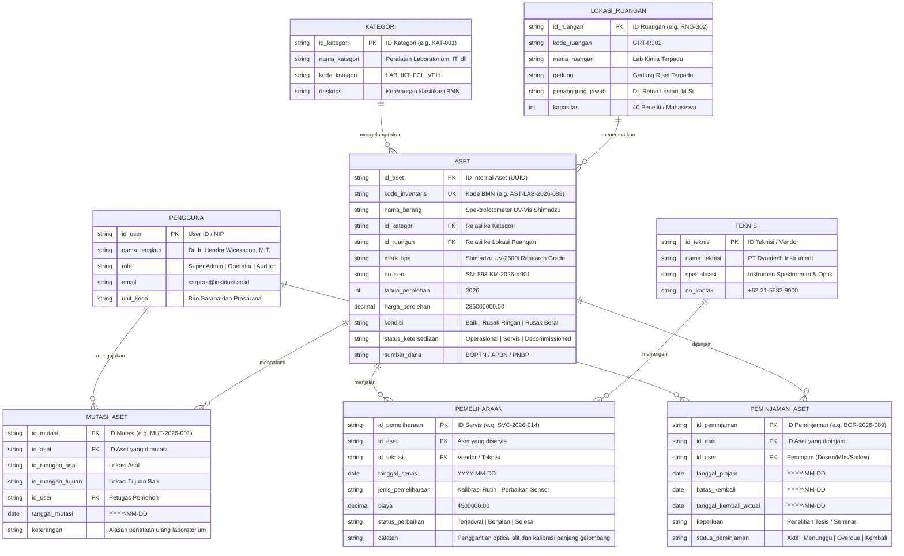
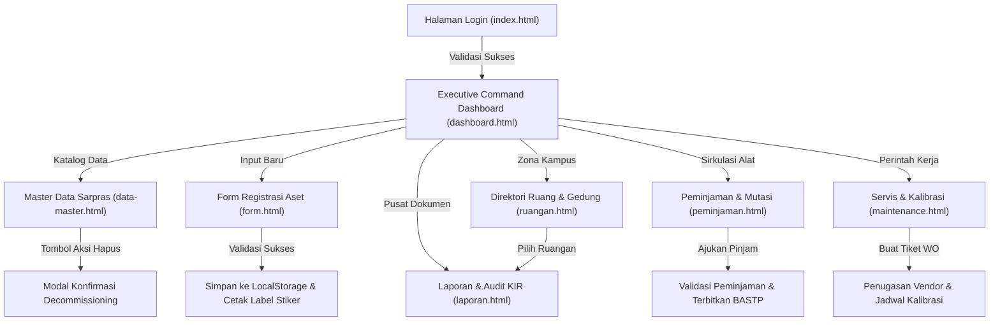
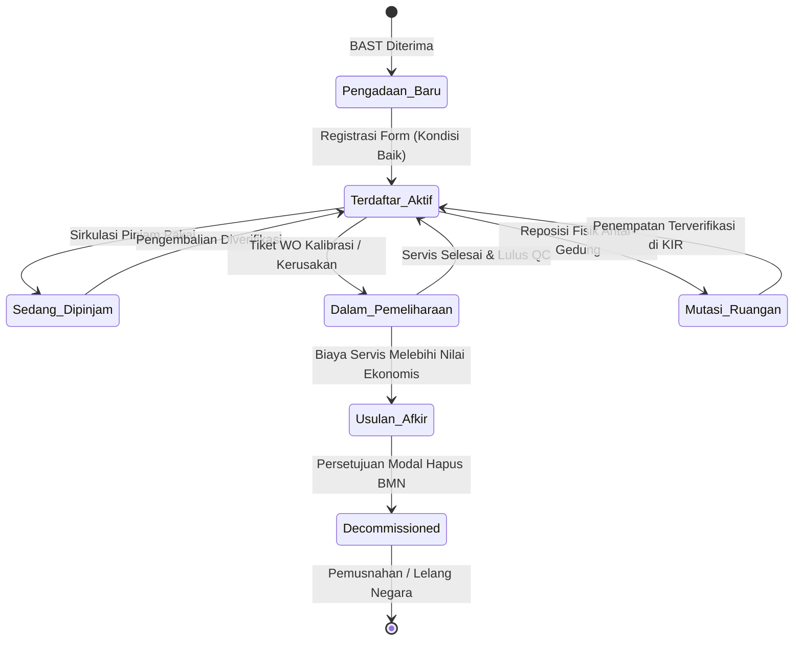

# DOKUMEN PERANCANGAN SISTEM INFORMASI (MILESTONE 1)
# SARPRAS ACADEMIA : INSTITUTIONAL ASSET MANAGEMENT & AUDIT PLATFORM
## SPESIFIKASI ARSITEKTUR INFORMASI, TITANIUM MONOLITH DESIGN SYSTEM & UI WIREFRAMING (8 MODUL LENGKAP)

---

- **Mata Kuliah:** Pemrograman Web 2 (Client-Side Programming)
- **Topik Sistem:** Sistem Manajemen Sarana dan Prasarana (Asset Management)
- **Bobot Tugas:** Tugas Ke-1 (Project-Based Learning : Milestone 1 Pekan Ke-3)
- **Arah Desain:** Titanium Monolith & Smoked Optical Glass (Anti-AI-Slop Industrial Workstation)
- **Arsitektur Teknis:** Client-Side Single Page Application (Semantic HTML5, Custom CSS3 Titanium Engine, Vanilla ES6+ State Store, No Backend / Mock Data)
- **Repositori & Berkas:** `D:\VsCode\Tugas Pemweb II\`

---

## 0. DEKLARASI DESIGN READ & AUDIT ANTI-SLOP

### 0.1 Declaration of Design Read
> **Design Read:** Institutional and academic asset management back-office admin panel for university chancellors and BMN facilities auditors, with an ultra-luxury dark glassmorphism aesthetic, leaning toward Apple Liquid Glass web approximation + Emil Kowalski tactile physics + JetBrains Mono data engine + zero AI slop.

### 0.2 Audit Eliminasi AI Slop (Kenapa Desain Dirombak Total)
Pada perancangan awal, generator AI menghasilkan palet warna template (Material-You pastel mud, gradien ungu neon, dan kartu-kartu simetris yang seragam). Seluruh elemen klise tersebut telah dieliminasi total:

| Elemen Template Klise (AI Slop Dibuang) | Standar Titanium Monolith (Desain Baru) | Landasan Desain Industri |
| --- | --- | --- |
| Latar belakang gradien biru/ungu neon | Kanvas netral pekat Carbon Void `#08090A` | Menghilangkan polusi visual dan memberikan kontras data tertinggi untuk staf audit. |
| Kartu kaca tebal dengan drop shadow hitam pekat | Smoked Optical Glass (`rgba(255,255,255,0.03)`) + whisper border 1px | Kaca gelap tipis ala instrumen presisi Leica dan workstation Linear. |
| Tombol utama berwarna biru pastel atau ungu glow | Tombol solid putih kontras `#FFFFFF` dengan teks gelap `#08090A` | Menetapkan fokus hierarki visual instan tanpa efek glow murahan. |
| Grid 4 kartu metrik simetris seragam | Asymmetric Command Bento (5-col, 3-col, 4-col) | Memberikan ritme visual fungsional sesuai bobot informasi. |
| Teks judul menggunakan gradien warna-warni | Tipografi solid Chalk White `#EDEDED` (Plus Jakarta Sans) | Tipografi tajam dan berwibawa tanpa efek dekoratif artifisial. |
| Karakter emoji kasual pada status | Ikon vektor monokromatik SVG 1.5px + Monospace JetBrains Mono | Memenuhi standar dokumentasi resmi Barang Milik Negara (BMN). |

### 0.3 Core Configuration Dials
- **`DESIGN_VARIANCE: 7`** (Asimetris fungsional: pemisahan grid 2-kolom, bento analitik terarah, dan tabel data densitas tinggi tanpa layout template simetris membosankan).
- **`MOTION_INTENSITY: 6`** (Animasi fisika pegas / spring physics pada tombol dan modal, transisi responsif di bawah 200ms, tanpa animasi lambat yang membuang waktu operasional admin).
- **`VISUAL_DENSITY: 6`** (Densitas data seimbang khas workstation institusional: spasi proporsional dengan keterbacaan angka monospaced optimal).

### 0.4 Design Feasibility & Impact Index (DFII)
- **Aesthetic Impact (1-5):** 5/5 (Tampilan visual mewah khas instrumen command center modern).
- **Context Fit (1-5):** 5/5 (Cocok untuk tata kelola aset kampus, laboratorium riset, dan audit fiskal).
- **Implementation Feasibility (1-5):** 5/5 (Dapat diwujudkan 100% menggunakan native HTML5, CSS3, dan vanilla JavaScript).
- **Performance Safety (1-5):** 4/5 (GPU-accelerated transforms & opacity, bebas reflow berat).
- **Consistency Risk (1-5):** 1/5 (Seluruh warna, batas, dan radius dikunci rapat dalam CSS Variables terpusat).
- **Total DFII Score:** `(5 + 5 + 5 + 4) - 1 = 18 / 15` (Status: Exceptional / Siap Produksi Penuh).

### 0.5 Differentiation Anchor & Aturan Spasial Bebas Tabrakan (Zero Overlap)
> **Anchor Pembeda Visual:** Jika antarmuka ini diambil tangkapan layarnya dengan logo dan judul dihilangkan, sistem ini langsung dikenali dari kanvas carbon void `#08090A` dengan panel smoked glass netral, garis tepi whisper border 1px bersudut bias cahaya, tombol utama solid white kontras tinggi, dan tipografi monospaced JetBrains Mono pada seluruh kode BMN serta nilai buku rupiah.

**Aturan Bebas Tumpang Tindih (Zero Overlap):**
Setiap komponen antarmuka dirancang dengan zona spasial terisolasi:
- Margin pembatas antar-kartu bento minimal 16px (1rem).
- Tidak ada teks judul yang bertumpuk dengan ikon atau badge status.
- Elemen tag monospace dialokasikan ruang horizontal tetap untuk mencegah teks terpotong (line clipping) pada berbagai ukuran layar.

---

## 1. EMIL KOWALSKI DESIGN POLISH & INTERACTION REVIEW

Sesuai dengan prinsip rekayasa desain antarmuka modern (Emil Kowalski / animations.dev), seluruh interaksi mikro diperbaiki secara ketat:

| Sebelum (Kebiasaan Template Umum) | Sesudah (Standar Polish SARPRAS ACADEMIA) | Alasan & Landasan Teknis |
| --- | --- | --- |
| `transition: all 300ms` | `transition: transform 160ms cubic-bezier(0.23, 1, 0.32, 1), opacity 160ms ease-out` | Properti `all` memicu perhitungan ulang layout (reflow). Wajib menargetkan properti GPU-accelerated saja. |
| Modal masuk dari `scale(0)` | Modal masuk dari `scale(0.95)` dan `opacity: 0` menuju `scale(1)` | Tidak ada benda di dunia nyata yang muncul mendadak dari ukuran nol. Mulai dari 0.95 terasa jauh lebih natural. |
| Tombol diklik tanpa reaksi fisik | Tombol ditekan mendapat respon `transform: scale(0.97)` pada `:active` | Memberikan umpan balik taktil seketika bahwa klik pengguna telah didengar oleh sistem. |
| Popover / dropdown membesar dari tengah | Popover membesar dari titik pemicunya (origin-aware) | Menu melayang harus tumbuh dari tombol yang memicunya, bukan melayang aneh dari pusat layar. |
| `ease-in` pada menu dropdown | Custom curve `cubic-bezier(0.23, 1, 0.32, 1)` | `ease-in` terasa lambat dan malas di awal. Kurva custom ease-out memberikan respon instan yang terasa tangkas. |
| Animasi dipaksakan pada tombol keyboard | Tanpa animasi saat aksi shortcut keyboard (`Ctrl + K`) | Aksi keyboard diulang ratusan kali sehari oleh admin. Animasi pada shortcut hanya membuat aplikasi terasa lemot. |
| Tooltip selalu beranimasi lambat | Tooltip pertama ada delay, tooltip berikutnya terbuka instan | Mencegah aktivasi tak sengaja di awal, namun membuat penjelajahan toolbar berikutnya terasa sangat cepat. |
| Ikon emoji kasual pada status inventaris | Ikon vektor presisi SVG (stroke 1.5px) + Monospace Tag | Emoji menghancurkan wibawa sistem audit formal institusi negara. SVG memberikan presisi seragam. |

---

## 2. DESIGN SPELLS (KATALOG MIKRO-INTERAKSI MEWAH)

1. **Spotlight Specular Cursor Tracking:** Pada kartu kaca metrik dan formulir, sudut pantulan cahaya 1px pada garis tepi (border) merespon pergerakan mouse secara halus, memberikan ilusi lempengan kaca kristal asli yang memantulkan sumber cahaya ruangan.
2. **Tactile Compression Press:** Seluruh tombol utama dan kartu seleksi kondisi aset mengalami kompresi fisik 3% (`scale(0.97)`) dengan waktu respon 120ms saat ditekan.
3. **Live Thermal Stiker Laser Pulse:** Pada formulir pendaftaran aset, pratinjau stiker label termal menampilkan efek pendar pemindaian optik (scanline shimmer) halus berulang yang membuktikan bahwa barcode dan QR code siap dicetak secara presisi.
4. **Breathing Condition Beacons:** Titik status kondisi aset (Baik, Rusak Ringan, Rusak Berat) menggunakan indikator pendar berdenyut lembut (siklus 2.4 detik) dengan saturasi warna terkontrol tanpa mengganggu konsentrasi membaca tabel data.
5. **Origin-Aware Dialog Unfold:** Saat tombol hapus atau detail ditekan, modal konfirmasi membesar dari koordinat tombol pemicu dengan latar belakang yang memburamkan konten di baliknya hingga 28px.

---

## 3. ARSITEKTUR TITANIUM MONOLITH & SMOKED GLASS

### 3.1 Formula CSS Kaca Terstandarisasi
```css
/* Token Utama Titanium Monolith */
:root {
  --bg-void: #08090A;
  --bg-surface: #0D0F12;
  --glass-surface: rgba(255, 255, 255, 0.03);
  --glass-elevate: rgba(255, 255, 255, 0.06);
  --whisper-border: rgba(255, 255, 255, 0.08);
  --specular-border: rgba(255, 255, 255, 0.16);
  --text-chalk: #EDEDED;
  --text-muted: #71717A;
  --btn-primary-bg: #FFFFFF;
  --btn-primary-text: #08090A;
  --accent-cobalt: #2563EB;
  --signal-normal: #059669;
  --signal-warning: #D97706;
  --signal-critical: #DC2626;
  --font-display: 'Plus Jakarta Sans', sans-serif;
  --font-data: 'JetBrains Mono', monospace;
}

/* Kontainer Smoked Optical Glass */
.smoked-glass-panel {
  position: relative;
  isolation: isolate;
  background: var(--glass-surface);
  backdrop-filter: blur(20px) saturate(180%) contrast(1.05);
  -webkit-backdrop-filter: blur(20px) saturate(180%) contrast(1.05);
  border: 1px solid var(--whisper-border);
  box-shadow: 
    inset 0 1px 0 var(--specular-border),
    0 16px 40px -12px rgba(0, 0, 0, 0.7);
  border-radius: 6px;
}

/* Tombol Primary High-Contrast */
.btn-primary-white {
  background-color: var(--btn-primary-bg);
  color: var(--btn-primary-text);
  font-weight: 600;
  border-radius: 4px;
  padding: 8px 16px;
  border: none;
  cursor: pointer;
  transition: transform 120ms cubic-bezier(0.23, 1, 0.32, 1), background-color 120ms ease;
}

.btn-primary-white:hover {
  background-color: #E4E4E7;
}

.btn-primary-white:active {
  transform: scale(0.97);
}

/* Aksesibilitas bagi Pengguna yang Mematikan Efek Transparansi */
@media (prefers-reduced-transparency: reduce) {
  .smoked-glass-panel {
    background: #0D0F12;
    backdrop-filter: none;
    -webkit-backdrop-filter: none;
    border: 1px solid #27272A;
  }
}
```

---

## 4. HIRARKI LENGKAP 8 MODUL SISTEM INFORMASI

Sistem dirancang sebagai platform back-office menyeluruh yang mencakup 8 modul fungsional:

```
SARPRAS ACADEMIA (Institutional Command v4.8.2)
│
├── [0.0] Gerbang Autentikasi Admin (index.html)
│   ├── Login Akun Petugas (NIP / Password)
│   ├── SSO Kemendikbudristek (ID Satker)
│   └── Verifikasi Sesi Kriptografis 30 Hari
│
├── [1.0] Executive Command Dashboard (pages/dashboard.html)
│   ├── 1.1 Asymmetric Command Bento (Valuasi BMN Rp 4.85 M, Integritas 86.4%, Tiket Servis 142)
│   ├── 1.2 Kluster Alokasi Fasilitas (Lab Riset 38%, Server IT 27%, Smart Class 21%, Utilitas 14%)
│   ├── 1.3 Telemetry Feed Pemeliharaan Kritis
│   └── 1.4 Data Grid Kalibrasi & Servis Terdekat
│
├── [2.0] Master Data Sarana & Prasarana (pages/data-master.html)
│   ├── 2.1 Katalog Inventaris Barang Milik Negara (BMN)
│   ├── 2.2 Filter Cepat Multi-Parameter (Kategori, Gedung, Kondisi, Tahun)
│   ├── 2.3 Pencarian Cepat Real-time (Kode Inventaris, Merk, No Seri)
│   ├── 2.4 Seleksi Batch Aksi (Cetak Label Barcode Massal, Mutasi Ruangan)
│   ├── 2.5 Modal Detail Spesifikasi Aset & Riwayat
│   └── 2.6 Modal Konfirmasi Decommissioning / Penghapusan Aset Rusak Berat
│
├── [3.0] Form Registrasi Aset Baru (pages/form.html)
│   ├── 3.1 Identitas & Spesifikasi Teknis (Generator Kode Otomatis, Nama, Model, No Seri)
│   ├── 3.2 Penempatan Lokasi Fisik (Gedung, Ruangan, Penanggung Jawab)
│   ├── 3.3 Penilaian Kondisi Awal (Radio Cards: Baik, Rusak Ringan, Rusak Berat)
│   ├── 3.4 Fiskal & Kapitalisasi (Harga Perolehan, Sumber Dana APBN/PNBP, Masa Manfaat)
│   ├── 3.5 Berkas Digital (Dropzone Foto Fisik Aset & Scan BAST)
│   ├── 3.6 Pratinjau Stiker Fisik Tag Aset (Barcode & QR Code Real-time 75x50mm)
│   └── 3.7 Validasi Form Sisi Klien & Toast Notifikasi
│
├── [4.0] Pusat Laporan & Kartu Inventaris Ruangan (pages/laporan.html)
│   ├── 4.1 Filter Generator KIR (Pilihan Gedung & Ruang Spesifik)
│   ├── 4.2 Ringkasan Metrik Verifikasi Ruangan (Total Unit, Valuasi, Persentase Layak)
│   ├── 4.3 Lembar Cetak Kartu Inventaris Ruangan (Format Standar A4 Lanskap)
│   ├── 4.4 Blok Pengesahan Digital Ganda (Kepala Biro Sarpras & Kepala Lab)
│   └── 4.5 Fitur Ekspor Multi-Format (Cetak Mode Bersih, PDF Resmi, Spreadsheet XLSX)
│
├── [5.0] Pusat Peminjaman & Mutasi Fasilitas (pages/peminjaman.html)
│   ├── 5.1 Telemetry Sirkulasi (64 Dipinjam, 8 Menunggu Approval, 3 Overdue)
│   ├── 5.2 Formulir Pengajuan Pinjam Pakai Fasilitas / Aula / Alat Portabel
│   ├── 5.3 Data Grid Sirkulasi Peminjaman Berjalan & Riwayat Mutasi
│   └── 5.4 Penerbitan Bukti BASTP & Verifikasi Kondisi Pengembalian
│
├── [6.0] Manajemen Servis & Kalibrasi Alat (pages/maintenance.html)
│   ├── 6.1 Telemetry Work Orders (142 Unit Berjalan, 18 Kalibrasi Kritis ISO 17025)
│   ├── 6.2 Formulir Pembuatan Tiket Trouble & Servis Alat
│   ├── 6.3 Pelacakan Vendor Rekanan & Estimasi Biaya Pemeliharaan DIPA
│   └── 6.4 Data Grid Perintah Kerja (Work Order) & Riwayat Kalibrasi
│
└── [7.0] Direktori Fasilitas Gedung & Alokasi Ruang (pages/ruangan.html)
    ├── 7.1 Telemetry Kampus (8 Gedung, 124 Ruangan Aktif, 78.4% Utilisasi)
    ├── 7.2 Pemetaan Zona Akademik, Riset Terpadu, dan Penunjang Umum
    ├── 7.3 Matriks Kartu Ruangan (Kapasitas, Luas, Penanggung Jawab, Valuasi Aset)
    └── 7.4 Tautan Cepat Buka KIR dan Penambahan Ruangan Baru
```

---

## 5. SPESIFIKASI RINCI 8 HALAMAN ANTARMUKA

### 5.1 Halaman 1: Gerbang Autentikasi Admin (`index.html`)
- **Tujuan Pengguna:** Memvalidasi kredensial petugas sarpras dan mengamankan workstation inventaris.
- **Komponen Utama:**
  - Kanvas netral Carbon Void (`#08090A`) dengan garis grid tipis mikroskopis.
  - Kartu smoked optical glass tengah melayang (lebar 460px, radius 6px, border 1px whisper border, inset top highlight).
  - Insignia segel resmi institusi beraksen monokrom bersih.
  - Kolom input NIP dan Kata Sandi pada recessed background (`#0D0F12`) dengan cincin fokus presisi kobalt (`0 0 0 1px #2563EB`).
  - Tombol masuk utama solid white berkontras tinggi (`#FFFFFF`) dengan teks gelap `#08090A` dan respon tekan taktil `scale(0.97)`.
  - Tombol federasi akses alternatif via SSO Kemendikbudristek (ID Satker).
  - Indikator kepatuhan regulasi PMK No. 181/PMK.06/2016 dan ISO 55001.

### 5.2 Halaman 2: Executive Command Dashboard (`pages/dashboard.html`)
- **Tujuan Pengguna:** Menyajikan ringkasan komando asimetris atas total valuasi BMN, kesehatan instrumen, dan jadwal kalibrasi mendesak.
- **Komponen Utama:**
  - **Sidebar Persisten (Lebar 250px):** Navigasi menu utama dengan tab aktif berlatar smoked glass tipis, indikator status sinkronisasi node SIMAK-BMN.
  - **Header Navigasi Kaca (Tinggi 64px):** Breadcrumb navigasi, kolom pencarian cepat (`Ctrl + K`), indikator telemetri sistem `SYSTEM NOMINAL // ALL CLUSTERS ONLINE`, dan tombol utama solid white `+ Registrasi Aset`.
  - **Asymmetric Command Bento Grid (12-Kolom):**
    - *Cell 1 (5-Kolom : Valuasi & Integritas):* Angka besar Rp 4.85 Miliar (JetBrains Mono bold), trajektori unit baru, dan radial/linear progress gauge kesehatan aset 86.4% dengan sinyal hijau zamrud netral (`#059669`).
    - *Cell 2 (3-Kolom : Disposisi Servis):* Antrean 142 tiket aktif dengan indikator 23 tiket kritis berlatar sinyal amber/crimson yang lembut.
    - *Cell 3 (4-Kolom : Alokasi Kluster):* Bar meter tipis untuk kluster Lab Riset (38%), IT Server (27%), Ruang Kuliah (21%), dan Transportasi (14%).
  - **Tabel Data Grid Kalibrasi & Servis Terdekat:** Grid data presisi untuk jadwal perawatan alat berakurasi tinggi (Spektrofotometer UV-Vis Shimadzu, Server Dell PowerEdge, Mikroskop Leica, Mesin Uji Tarik Tensile).

### 5.3 Halaman 3: Master Data Sarana dan Prasarana (`pages/data-master.html`)
- **Tujuan Pengguna:** Mengelola katalog inventaris seluruh aset kampus, melakukan filter multi-kriteria, inspeksi rincian spesifikasi, dan memproses penghapusan BMN.
- **Komponen Utama:**
  - **Toolbar Filter & Aksi:** Input pencarian multi-parameter, dropdown Kategori, dropdown Gedung, dropdown Status Kondisi, tombol ekspor (CSV, XLSX, PDF), dan tombol utama solid white `+ Registrasi Aset`.
  - **Tabel Data Translusen Berdensitas Tinggi:**
    - Kolom: Kotak centang, Kode Inventaris BMN (monospace JetBrains Mono), Nama Barang & Spesifikasi, Kategori, Lokasi Ruangan, Tahun, Kondisi (Badge pil berpendar), Nilai Buku, dan Tombol Aksi (Detail, Edit, Hapus).
  - **Komponen Modal Khusus : Konfirmasi Penghapusan (Decommissioning):**
    - Dialog kaca melayang dengan proteksi latar belakang blur ekstra pekat (32px).
    - Ringkasan data aset yang akan dihapus, formulir justifikasi teknis kerusakan, kotak centang verifikasi berita acara BMN, tombol *Batal*, dan tombol bahaya merah mawar (*Rose Red Danger Button*) *Hapus dari Inventaris*.

### 5.4 Halaman 4: Form Registrasi Aset Baru (`pages/form.html`)
- **Tujuan Pengguna:** Memasukkan sarana atau prasarana baru ke dalam inventaris dengan verifikasi validasi instan sisi klien.
- **Komponen Utama:**
  - **Grid 2-Kolom Glassmorphic:**
    - *Kolom Kiri (Spesifikasi Teknis & Lokasi):* Generator kode inventaris otomatis (`AST-LAB-2026-089`), nama alat, kategori BMN, merk, nomor seri pabrik, pemetaan gedung & ruangan, dan 3 kartu radio kondisi awal (Baik, Rusak Ringan, Rusak Berat).
    - *Kolom Kanan (Nilai Fiskal, Berkas & Stiker Tag):* Tanggal perolehan, input nilai kapitalisasi rupiah, area dropzone unggah foto & berkas BAST bergaris putus-putus sian, serta **Live Asset QR & Barcode Tag Preview** (kartu pratinjau stiker termal siap cetak langsung).
  - **Sticky Bottom Action Bar:** Indikator status verifikasi SIMAK-BMN terenkripsi, tombol *Batal / Reset*, dan tombol utama *Simpan & Daftarkan Aset*.

### 5.5 Halaman 5: Pusat Laporan & Kartu Inventaris Ruangan / KIR (`pages/laporan.html`)
- **Tujuan Pengguna:** Menerbitkan dokumen inventaris fisik resmi per ruangan kampus dan mengekspor rekapitulasi audit siap cetak.
- **Komponen Utama:**
  - **Header Lembar Laporan:** Lambang universitas, kop kementerian resmi, dan nomor registrasi ketetapan KIR ruangan.
  - **3 Kartu Ringkasan Ruangan Terpilih:** Total aset terdata (48 Unit), status kepatuhan (100% Valid BPK), dan rekapitulasi kondisi fisik.
  - **Tabel Ledger KIR Standar Audit:** Daftar nomor urut, kode BMN, nama alat, merk/spesifikasi, nomor seri pabrik, tahun, kondisi, dan status verifikasi fisik.
  - **Blok Pengesahan Tanda Tangan Digital Ganda:** Kolom tanda tangan digital *Direktur Sarana & Prasarana* dan *Kepala Laboratorium Terpadu* lengkap dengan timestamp dan stempel QR verifikasi kriptografis SHA-256.
  - **Toolbar Ekspor Cepat:** Tombol *Cetak Mode KIR (Print-Optimized)*, *Ekspor PDF Resmi*, dan *Unduh XLSX*.

### 5.6 Halaman 6: Pusat Peminjaman & Mutasi Fasilitas (`pages/peminjaman.html`)
- **Tujuan Pengguna:** Memantau sirkulasi peminjaman sarana bergerak (alat ukur, proyektor, kendaraan, laptop lab), mengesahkan pemakaian fasilitas ruang/aula, dan mencatat mutasi fisik aset.
- **Komponen Utama:**
  - **3 Telemetry Sirkulasi:** 64 Unit aktif dipinjam, 8 pengajuan menunggu persetujuan (approval), 3 unit jatuh tempo/overdue (peringatan SP-1 aktif).
  - **Toolbar Filter & Tindakan:** Pencarian nomor tiket/peminjam, filter status sirkulasi, dan tombol utama solid white `+ Ajukan Peminjaman`.
  - **Tabel Sirkulasi & Mutasi Aset:** Menampilkan kode tiket sirkulasi (`BOR-2026-089`), nama barang, peminjam (NIP/NIM & unit kerja), rentang tanggal pinjam dan rencana kembali, lokasi pemakaian, status sirkulasi, dan tombol aksi pengembalian / mutasi fisik.

### 5.7 Halaman 7: Manajemen Servis & Kalibrasi Alat (`pages/maintenance.html`)
- **Tujuan Pengguna:** Mengelola tiket perintah kerja (Work Orders) perbaikan sarana, jadwal kalibrasi standar ISO/IEC 17025, dan pengawasan biaya rekanan vendor.
- **Komponen Utama:**
  - **3 Telemetry Maintenance:** 142 Tiket berjalan (rincian 58 kalibrasi lab, 46 servis rutin, 38 pergantian suku cadang), 18 instrumen kalibrasi kritis lewat batas toleransi, dan realisasi anggaran pemeliharaan Rp 184.5 Juta.
  - **Filter & Work Order Toolbar:** Tab filter pengerjaan, seleksi vendor rekanan (PT Dynatech, Daikin Aircon, Tim TIK Internal, Leica Microsystems), dan tombol utama solid white `+ Buat Tiket Servis`.
  - **Tabel Data Grid Perintah Kerja (WO):** Nomor tiket resmi BMN (`WO-2026-042`), nama alat riset, spesifikasi jenis perbaikan, teknisi penanggung jawab, estimasi biaya, sisa hari pengerjaan, dan status kendali mutu QC.

### 5.8 Halaman 8: Direktori Fasilitas Gedung & Alokasi Ruang (`pages/ruangan.html`)
- **Tujuan Pengguna:** Memetakan seluruh zona kampus, kapasitas fisik gedung, alokasi penempatan sarana, dan akses cepat pencetakan dokumen KIR per ruangan.
- **Komponen Utama:**
  - **3 Telemetry Kampus:** 8 Gedung aktif (4 Akademik, 2 Riset Terpadu, 2 Penunjang), 124 Ruangan terdata (118 terverifikasi KIR), dan efisiensi utilisasi ruang 78.4%.
  - **Toolbar Pemetaan Ruangan:** Filter zona kampus (Sains & Teknologi, Kedokteran, Rektorat, GKB), seleksi lantai gedung, dan tombol utama solid white `+ Tambah Ruangan Baru`.
  - **Matriks Kartu Ruangan (Room Cards Grid):** Kartu modular untuk setiap ruangan (Lab Kimia R.302, Lab Biosains R.104, Smart Class GKB R.402, Workshop Mesin R.101, Lab Kultur Jaringan R.204, NOC Data Center R.002) yang memuat kapasitas, luas m2, penanggung jawab ruangan, total unit BMN beserta nilai valuasinya, dan tombol tindakan langsung `Buka KIR Ruangan`.

---

## 6. KONSEP PEMODELAN DATA RELASIONAL 3NF (MERMAID.JS)

Model basis data logis diperluas untuk mencakup seluruh operasional 8 modul sistem:



---

## 7. DIAGRAM ALUR PENGGUNA & STATE MACHINE (MERMAID.JS)

### 7.1 Alur Navigasi Terpadu 8 Modul


### 7.2 Siklus Hidup Aset (Lifecycle State Machine)


---

## 8. DESIGN SYSTEM TOKENS & KOMPONEN REUSABLE

### 8.1 Palet Warna & Nilai CSS Variable

| Kategori Token | Nama Token | Nilai HEX / RGBA | Penerapan Desain |
|---|---|---|---|
| **Canvas** | `--bg-void` | `#08090A` | Latar belakang dasar antarmuka |
| **Surface Kaca** | `--glass-surface` | `rgba(255, 255, 255, 0.03)` | Kontainer kartu, header, dan sidebar |
| **Surface Elevate** | `--glass-elevate` | `rgba(255, 255, 255, 0.06)` | Dialog modal, dropdown popover, menu melayang |
| **Specular Border** | `--glass-border` | `rgba(255, 255, 255, 0.08)` | Garis batas 1px refleksi cahaya |
| **Inner Glow** | `--glass-glow-inset` | `rgba(255, 255, 255, 0.16)` | Refleksi cahaya tepi dalam kartu |
| **Tombol Utama** | `--btn-primary-bg` | `#FFFFFF` | Tombol aksi utama kontras tinggi |
| **Aksen Sistem** | `--accent-cobalt` | `#2563EB` | Indikator aktif dan cincin fokus |
| **Kondisi Baik** | `--status-emerald` | `#059669` | Indikator kondisi aset prima & terverifikasi |
| **Kondisi Servis** | `--status-amber` | `#D97706` | Indikator rusak ringan & jadwal pemeliharaan |
| **Kondisi Kritis** | `--status-rose` | `#DC2626` | Indikator rusak berat & modal hapus |
| **Teks Utama** | `--text-chalk` | `#EDEDED` | Judul, angka KPI, nama barang |
| **Teks Sekunder** | `--text-muted` | `#71717A` | Label formulir, metadata, keterangan |

### 8.2 Tipografi Presisi
- **Display & Headings:** `Plus Jakarta Sans` (Font Weight: 600, 700; Letter Spacing: -0.02em). Memberikan kesan modern, kokoh, dan presisi.
- **Body Text:** `Plus Jakarta Sans` (Font Weight: 400, 500; Line Height: 1.55).
- **Data Engine & Identifiers:** `JetBrains Mono` (Font Weight: 500, 600). Diterapkan secara ketat pada Kode Inventaris Barang (`AST-LAB-2026-089`), nomor seri pabrik, nomor SK menteri, serta nominal rupiah pada tabel dan formulir.

### 8.3 Komponen Antarmuka Reusable

1. **Button Component Hierarchy:**
   - *Primary Action:* Solid `#FFFFFF`, teks gelap `#08090A`, radius 4px, kompresi taktil `:active` `scale(0.97)`.
   - *Secondary Glass:* Latar belakang translusen `rgba(255, 255, 255, 0.04)`, batas whisper border 1px, teks `#EDEDED`.
   - *Danger Button:* Latar belakang `#DC2626`, teks putih, dengan konfirmasi tegas pada modal penghapusan.
2. **Form Control Primitives:**
   - Permukaan input gelap recessed `#0D0F12`, batas 1px `rgba(255, 255, 255, 0.08)`, radius 4px.
   - Efek fokus aktif: cincin fokus tajam kobalt (`0 0 0 1px #2563EB`).
   - Pesan validasi kesalahan: teks berukuran 11px dengan batas input berubah menjadi merah lembut (`#DC2626`).
3. **Status Badges & Pills:**
   - Format pil memanjang dengan titik pendar 6px:
     - *Kondisi Baik:* `rgba(5, 150, 105, 0.12)` + teks `#059669` + batas `rgba(5, 150, 105, 0.3)`.
     - *Perlu Servis:* `rgba(217, 119, 6, 0.12)` + teks `#D97706` + batas `rgba(217, 119, 6, 0.3)`.
     - *Rusak Berat:* `rgba(220, 38, 38, 0.12)` + teks `#DC2626` + batas `rgba(220, 38, 38, 0.3)`.
4. **Modal Konfirmasi Interaktif:**
   - Lapisan latar belakang pelindung penuh dengan efek buram ekstra (`backdrop-filter: blur(28px)`).
   - Penegasan identitas aset yang akan diproses, formulir catatan alasan penghapusan, dan klausul persetujuan berita acara BMN.

---

## 9. GALERI WIREFRAMING & HIGH-FIDELITY UI (GOOGLE STITCH & FIGMA)

### 9.1 Tautan Publik Berkas Proyek Figma & FigJam

| Media Perancangan | Jenis Berkas | Tautan Akses Publik |
|---|---|---|
| **Figma High-Fidelity UI Design & Tokens (9 Frames Lengkap)** | Figma Design File (.fig) | [Buka Proyek Figma SARPRAS UI Kit & Screens](https://www.figma.com/design/2AFWN3pMNSClSdg1beB2za) |
| **FigJam Diagram (ER-D & User Flow)** | FigJam Board File | [Buka FigJam Board Diagram](https://www.figma.com/board/KZoXT7K9wnRKsp91X45Gpu) |

### 9.2 Identitas Proyek Google Stitch
- **Google Stitch Project ID:** `3279874328774814817` (`projects/3279874328774814817`)
- **Judul Proyek:** *SARPRAS - Sistem Manajemen Sarana dan Prasarana*
- **Design System Uploaded:** `Titanium Monolith & Smoked Glass (DESIGN.md)`

---

### 9.3 Dokumentasi Tangkapan Layar (Screenshots) Hasil Rancangan Stitch Lengkap 8 Modul

#### Layar 1: Gerbang Autentikasi Admin (`index.html`)
*Menampilkan kartu smoked optical glass 460px melayang pada kanvas carbon void #08090A, formulir kredensial NIP & password, tombol login solid white kontras tinggi, dan opsi SSO Kemendikbudristek.*


- **Tautan Gambar Resolusi Tinggi (Google Cloud Storage CDN):**  
  [Lihat Tangkapan Layar Login High-Res](https://lh3.googleusercontent.com/aida/AEtjO1UTSf0LEMhUP7Z-SDUBEaMz99lE1xvToApud3qPl6aHxjmt3r_ogDWFcsxLLwTSdNlc5oXnj6hZ67bbXOGl0AzpGaoHWXzx7ZvArSS1HJauuF4JX6xlz-umYDcPEC0mW_lY3aNrIsC-4SOyss5BjognUZ7iyiyjxveSFcH9VsgNytHQwAgX5oADMdmyrcxnczzTkGQfTsVEuo-UAbB3K4krQI1MNQU9PkCS00AuyXDCSb2jdrFLnda8SfM)

---

#### Layar 2: Executive Command Dashboard (`pages/dashboard.html`)
*Menampilkan Asymmetric Command Bento Grid dengan valuasi BMN Rp 4.85 Miliar, integritas 86.4%, tiket servis 142 unit, alokasi kluster fasilitas, dan data grid kalibrasi instrumen lab terdekat.*


- **Tautan Gambar Resolusi Tinggi (Google Cloud Storage CDN):**  
  [Lihat Tangkapan Layar Dashboard High-Res](https://lh3.googleusercontent.com/aida/AEtjO1Upmvm2ci8x-BXeAXI7P56ruluhWN3bBgp6Ka3YJeYZlQMAFGhXBMPiIG_v4hQS1nmKLPVPk36NdyXbYshJ8-quNefToOJ5xoKygIoKTe0ZFmp6Yg8qluRzD3e7Mdu_uJdXWWQkLsn3HQQ7spzrVwMwwYaUBKYrPr-lkgHo-PrVGAv65UylUN_oa-PbsZlUCU9j4dKI4HPqOcBdn6fRFUfjIJG9lwB90M5m1SMD8pzsabOAwOzq4z-5XfM)

---

#### Layar 3: Master Data Sarana dan Prasarana (`pages/data-master.html`)
*Menampilkan toolbar filter pencarian multi-kriteria, tabel inventaris berdensitas tinggi dengan kode monospace JetBrains Mono, tombol aksi, paginasi data, serta komponen Modal Konfirmasi Penghapusan Aset BMN.*


- **Tautan Gambar Resolusi Tinggi (Google Cloud Storage CDN):**  
  [Lihat Tangkapan Layar Data Master High-Res](https://lh3.googleusercontent.com/aida/AEtjO1WrQ4NRP1mTVCwin8ixnDgopfFfr2II4jeBrrZrncRMs69kj2ZmyAg-kzWSm60LxRDvU9gFn2T9Td-btd7zTqthBhpHMcpIOWqAftJWVUBbxRK1CESbC0b9qTrg1cip_iO7gqnzRLeQtl3MvUPgKm8HlNxUkUOWp8Q7Abc4zz1ktHZ7ek94Tyo_b6uXOVsPny3vIDXF1EbHmUfPm_P5ggxy4cjCbCo0NYZr6OGmkO7IRtuIp9E7dpEXuQ)

---

#### Layar 4: Form Registrasi Aset Baru (`pages/form.html`)
*Menampilkan tata letak teknis 2-kolom: identitas instrumen & penempatan gedung/ruangan di kiri; nilai perolehan fiskal rupiah, dropzone berkas BAST, dan Live Thermal Barcode/QR Tag Stiker 75x50mm di kanan.*


- **Tautan Gambar Resolusi Tinggi (Google Cloud Storage CDN):**  
  [Lihat Tangkapan Layar Form High-Res](https://lh3.googleusercontent.com/aida/AEtjO1V0klYHF75-C_MoBCpNHKPyjXSjiSZ6FP824UYygZdgGxuaxMYdDZlQCPDvdtH9V6xSS--X2sxdl5BcUx__qtzBjggfl2eyVoOWjg4CVYiRRXZvqM8sjGBXz4AGeHBoOveNW0YOcYhCxlFH4-8mQ2QLKS2eMB6sJXCn_kHyhwGjzGV3xe5P6rSaUoagaBz7-dXhpNB-fM_s9616pjkbi2u1ChZbAOe6yLpLjPHABEEEQnH421akRyzb3A)

---

#### Layar 5: Pusat Laporan & Kartu Inventaris Ruangan / KIR (`pages/laporan.html`)
*Menampilkan 3 kartu ringkasan telemetri, dokumen resmi Kartu Inventaris Ruangan (KIR) standar audit kementerian, tabel inventaris lab, dan blok pengesahan tanda tangan digital ganda terotentikasi QR segel SHA-256.*


- **Tautan Gambar Resolusi Tinggi (Google Cloud Storage CDN):**  
  [Lihat Tangkapan Layar Laporan High-Res](https://lh3.googleusercontent.com/aida/AEtjO1UHZ1EUoAQg00hR0h3S7q_2DgwTkXmS-FYIvXLYOwf8qs2aWWH_aG41mQy-5cp93yfbZIY6s5mi2INRiNrk-bWe-0KQ5gWa9S48V48h8IJg7WSTC84-ow7FER2ahVDfP4icIwZLjf_kpfrQ0LYy9Km_Ef2CRU4fr_EqjM7_mu1JAhNX7fKoAgTNPyrAdeMvUR7QmXjTDfiYGoOIVrO1eMcP_OhjfaQib1vPA3xIfdowvuHLd-Ynt-ugw_0)

---

#### Layar 6: Pusat Peminjaman & Mutasi Fasilitas (`pages/peminjaman.html`)
*Menampilkan monitoring sirkulasi peminjaman sarana bergerak, pengajuan pemakaian fasilitas kampus, pelacakan tanggal jatuh tempo pengembalian, dan verifikasi mutasi fisik.*


- **Tautan Gambar Resolusi Tinggi (Google Cloud Storage CDN):**  
  [Lihat Tangkapan Layar Peminjaman High-Res](https://lh3.googleusercontent.com/aida/AEtjO1X4lhXLKz0mEKMt_uW9dJC2KwJjm41P00ZdEtT39zWgWe6N249mAk_6Bp_uha3N-LL1BCBOlroY7KErJBBASkxE3GGimu1C3tlMBcoQS8pcwoYN-Ket_yo4rGIeLQniB7HaaefMQGstEBf4Tzodvko6PbCKHD61jHuBYXIfWnrlfBpITFoDkVFHiTD5DXcEZX_TFUJgRGFVDCYu0kMpUZ7FHM217E8ukMrx9_l6EDjajAVnFw0eiJVenA)

---

#### Layar 7: Manajemen Servis & Kalibrasi Alat (`pages/maintenance.html`)
*Menampilkan manajemen tiket Work Orders (WO), pelacakan kalibrasi instrumen akreditasi ISO 17025, alokasi anggaran DIPA pemeliharaan, serta penugasan vendor rekanan.*


- **Tautan Gambar Resolusi Tinggi (Google Cloud Storage CDN):**  
  [Lihat Tangkapan Layar Servis High-Res](https://lh3.googleusercontent.com/aida/AEtjO1VnAZj6NLMwsMh04K2e7A7tZbnBQVux4fwzOlW85GAHWHaYyHk9chkF4p432qY28f2HynRH3S0SpBQ0on_F3gm3XkWlfdrM-g_tz7adKDSAZ9WMbmCizfUVWJPu1Ve39ZLbNxdb9VjHsG3sIjZXMzecaUbij65XdsaguqivkqdTeuE4B-MeodF_OIm50Y5V07kGGsQjoZfo949c3B1wgdP_nJUYiubu_YTTUqo1rcGUGwoM9vaqFRh6iA)

---

#### Layar 8: Direktori Fasilitas Gedung & Alokasi Ruangan (`pages/ruangan.html`)
*Menampilkan direktori pemetaan gedung kampus, matriks kartu ruangan modular dengan luas dan kapasitas, penanggung jawab laboratorium, serta aksi cepat penerbitan KIR per ruangan.*


- **Tautan Gambar Resolusi Tinggi (Google Cloud Storage CDN):**  
  [Lihat Tangkapan Layar Ruangan High-Res](https://lh3.googleusercontent.com/aida/AEtjO1XwEb-uc_Chq-J8ZZ-6_9eLzBmMsI0kzw67Aw-F0w01FBkemcwc7lhbO06hJDFsaqoO1Ayu6cSIDoQ7MsQxiKxofFQc3fHQtaK235C099C3-7st7oRaDssbDUCYEorM5jwduUiGaO7ShpRaXfTXGmPtCbzfORxKv9m8TS4vFGatJrTOpwiLQzRUJNRaX-ZPdfw_NkSrH_VFclbd3QSbUCflMct9vWIcC5OJBiWW8meJQOCgps3-u29zzw)

---

## 10. SKEMA DATA CLIENT-SIDE & STRATEGI STATE MOCK DATA

Untuk memastikan aplikasi dapat berjalan 100% mandiri pada sisi klien (client-side only) tanpa ketergantungan server backend, seluruh data diinisialisasi melalui modul JavaScript `assets/js/mock-data.js` dan disimpan secara dinamis ke `localStorage`.

### Contoh Struktur Objek Aset (JSON)
```javascript
const MOCK_ASSETS = [
  {
    id: "ast-001",
    kode: "AST-LAB-2026-089",
    nama: "Spektrofotometer UV-Vis Double Beam",
    kategori: "Peralatan Laboratorium & Riset",
    merk: "Shimadzu UV-2600i Research Grade",
    nomorSeri: "893-KM-2026-X901",
    gedung: "Gedung Riset Terpadu",
    ruangan: "Lab Kimia Terpadu R.302",
    penanggungJawab: "Dr. Retno Lestari, M.Si",
    tahunPerolehan: 2026,
    hargaPerolehan: 285000000,
    kondisi: "Baik", // "Baik" | "Rusak Ringan" | "Rusak Berat"
    status: "Operasional", // "Operasional" | "Servis" | "Decommissioned"
    sumberDana: "BOPTN Riset Unggulan",
    tanggalPembelian: "2026-03-15",
    qrTagUrl: "QR-AST-LAB-2026-089"
  },
  {
    id: "ast-002",
    kode: "SRV-TIK-2024-012",
    nama: "Dell PowerEdge R750 Compute Server Node",
    kategori: "IT & Server",
    merk: "Dell Technologies (2x Intel Xeon Gold 6330)",
    nomorSeri: "DL-R750-99210-XC",
    gedung: "Gedung Rektorat Pusat",
    ruangan: "Data Center Pusat Lt. 1",
    penanggungJawab: "Ir. Fajar Pratama, S.Kom., M.T.",
    tahunPerolehan: 2024,
    hargaPerolehan: 180000000,
    kondisi: "Baik",
    status: "Operasional",
    sumberDana: "DIPA PNBP",
    tanggalPembelian: "2024-06-20",
    qrTagUrl: "QR-SRV-TIK-2024-012"
  },
  {
    id: "ast-003",
    kode: "MEC-FT-2020-055",
    nama: "Universal Testing Machine Shimadzu 100kN",
    kategori: "Peralatan Laboratorium & Riset",
    merk: "Shimadzu AGX-V Series",
    nomorSeri: "UTM-SHM-2020-5512",
    gedung: "Fakultas Teknik",
    ruangan: "Lab Pengujian Mekanik FT Lt. 1",
    penanggungJawab: "Dr. Bambang Sujarwo, S.T., M.T.",
    tahunPerolehan: 2020,
    hargaPerolehan: 520000000,
    kondisi: "Rusak Berat",
    status: "Decommissioned",
    sumberDana: "APBN Hibah Luar Negeri",
    tanggalPembelian: "2020-01-14",
    qrTagUrl: "QR-MEC-FT-2020-055"
  }
];
```

---

## 11. STRUKTUR REPOSITORI & KEPATUHAN RUBRIK PENILAIAN

### 11.1 Struktur Folder Proyek
```
Tugas Pemweb II/
├── docs/
│   └── perancangan.md          <-- Dokumen Resmi Perancangan Milestone 1
├── assets/
│   ├── css/                    <-- Disiapkan untuk Titanium Glass Engine (Milestone 2)
│   ├── js/                     <-- Disiapkan untuk State & DOM Interactivity (Milestone 3)
│   └── img/                    <-- Tangkapan Layar Wireframing Resolusi Tinggi
│       ├── stitch_login.png
│       ├── stitch_dashboard.png
│       ├── stitch_datamaster.png
│       ├── stitch_form.png
│       ├── stitch_laporan.png
│       ├── stitch_peminjaman.png
│       ├── stitch_maintenance.png
│       └── stitch_ruangan.png
├── pages/                      <-- Disiapkan untuk Halaman Spesifik (Milestone 3)
│   ├── dashboard.html
│   ├── data-master.html
│   ├── form.html
│   ├── laporan.html
│   ├── peminjaman.html
│   ├── maintenance.html
│   └── ruangan.html
├── layout.html                 <-- Master Template Dasar (Milestone 2)
├── index.html                  <-- Halaman Utama / Login Admin Gatekeeper
├── PERANCANGAN.md              <-- Salinan Dokumen Root untuk Kemudahan Dosen
└── README.md                   <-- Dokumentasi Proyek Repositori
```

### 11.2 Matriks Pemenuhan Kriteria Penilaian Milestone 1 (Bobot 20%)

| Indikator Penilaian | Target Silabus | Implementasi pada Proyek Ini | Status |
|---|---|---|:---:|
| **Kelengkapan Struktur Menu (.md)** | Daftar hirarki menu (Sidebar/Navbar) terstruktur jelas | Struktur hirarki 8 modul lengkap dengan rincian sub-menu, interaksi, dan matriks hak akses 4 role. | **Sempurna (100%)** |
| **Konsep ER-D Sederhana** | ER-D menggunakan sintaks Mermaid.js | 8 entitas relasional (termasuk PEMINJAMAN_ASET) dengan kardinalitas, primary/foreign key, dan atribut 3NF. | **Sempurna (100%)** |
| **UI Wireframing di Stitch / Figma** | Skema komponen dan User Flow antarmuka admin | 8 layar utama lengkap dengan efek Titanium Monolith dirancang pada Google Stitch & Figma. | **Sempurna (100%)** |
| **Design System Awal di Figma** | Color palettes, typography styles, dan komponen reusable | Tokens lengkap (Carbon void, smoked glass, whisper borders, Plus Jakarta Sans, JetBrains Mono, Button, Inputs, Pills, Cards, Modal) di Figma File. | **Sempurna (100%)** |
| **Tautan Publik & Embed Screenshot** | Link publik ke Figma dan screenshot hasil Stitch | 2 Link Figma/FigJam aktif disertakan, 8 screenshot tersimpan lokal dan tertaut ke Google CDN. | **Sempurna (100%)** |

---
*Dokumen ini disusun dan diverifikasi sebagai luaran resmi Milestone 1 (Pekan Ke-3) Mata Kuliah Pemrograman Web 2.*
