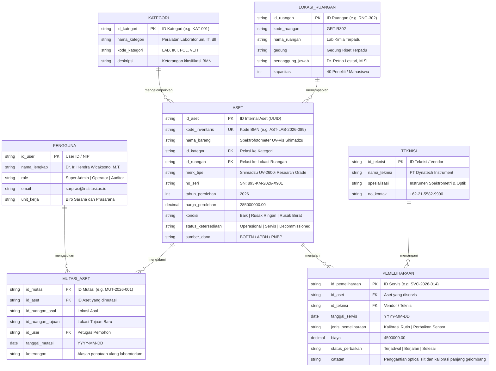
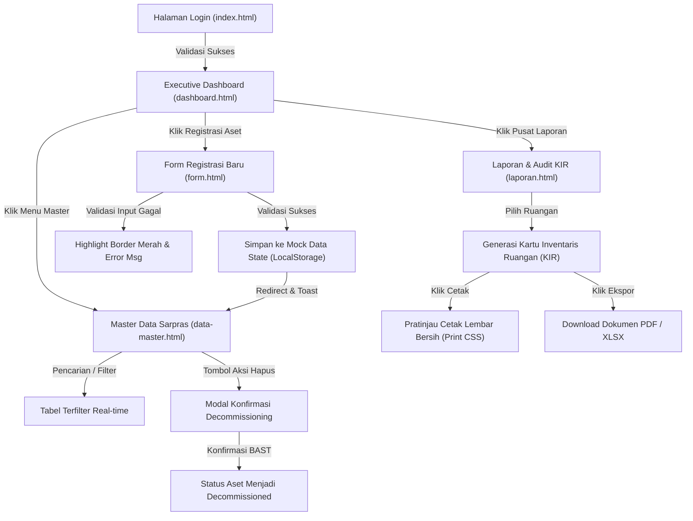
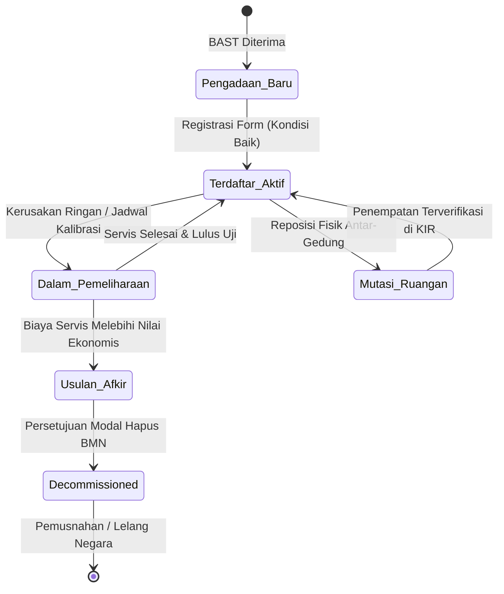

# DOKUMEN PERANCANGAN SISTEM INFORMASI (MILESTONE 1)
# SARPRAS ACADEMIA — INSTITUTIONAL ASSET MANAGEMENT & AUDIT PLATFORM
## SPESIFIKASI ARSITEKTUR INFORMASI, DESIGN SYSTEM GLASSMORPHISM & UI WIREFRAMING

---

- **Mata Kuliah:** Pemrograman Web 2 (Client-Side Programming)
- **Topik Sistem:** Sistem Manajemen Sarana dan Prasarana (Asset Management)
- **Bobot Tugas:** Tugas Ke-1 (Project-Based Learning — Milestone 1 Pekan Ke-3)
- **Estetika Antarmuka:** True Ultra-Luxury Glassmorphism (Deep Obsidian Void, Chromatic Ambient Refraction, Specular Beveled Edges)
- **Arsitektur Teknis:** Client-Side Single Page Application (Pure Semantic HTML5, CSS3 Glass Engine, Vanilla ES6+ State Store, No Backend/Mock Data)
- **Repositori & Berkas:** `D:\VsCode\Tugas Pemweb II\`

---

## DAFTAR ISI
1. [Ringkasan Eksekutif & Landasan Regulasi](#1-ringkasan-eksekutif--landasan-regulasi)
2. [Fisika Desain: True Glassmorphism Architecture](#2-fisika-desain-true-glassmorphism-architecture)
3. [Hirarki Menu & Matriks Peran Pengguna (RBAC)](#3-hirarki-menu--matriks-peran-pengguna-rbac)
4. [Spesifikasi Rinci Halaman Antarmuka (5 Halaman Utama)](#4-spesifikasi-rinci-halaman-antarmuka-5-halaman-utama)
5. [Konsep Pemodelan Data Relasional (ER-D Mermaid.js)](#5-konsep-pemodelan-data-relasional-er-d-mermaidjs)
6. [Diagram Alur Pengguna & State Machine (Mermaid.js)](#6-diagram-alur-pengguna--state-machine-mermaidjs)
7. [Design System Tokens & Komponen Reusable](#7-design-system-tokens--komponen-reusable)
8. [Galeri Wireframing & High-Fidelity UI (Google Stitch & Figma)](#8-galeri-wireframing--high-fidelity-ui-google-stitch--figma)
9. [Skema Data Client-Side & Strategi State Mock Data](#9-skema-data-client-side--strategi-state-mock-data)
10. [Struktur Repositori & Kepatuhan Rubrik Penilaian](#10-struktur-repositori--kepatuhan-rubrik-penilaian)

---

## 1. Ringkasan Eksekutif & Landasan Regulasi

Sistem Informasi Manajemen Sarana dan Prasarana (**SARPRAS ACADEMIA**) adalah platform antarmuka back-office institusional kelas enterprise yang dirancang untuk mengelola siklus hidup aset tetap (*fixed assets*), fasilitas fisik, peralatan laboratorium presisi tinggi, dan sarana teknologi informasi pada institusi pendidikan tinggi serta lembaga riset.

### 1.1 Tujuan Utama Sistem
1. **Transparansi & Akuntabilitas Fiskal:** Menyajikan pencatatan inventaris terpusat yang mematuhi standar penomoran Barang Milik Negara (BMN) dan penghitungan depresiasi buku secara real-time.
2. **Mitigasi Downtime Operasional:** Memonitor jadwal pemeliharaan berkala, kalibrasi instrumen riset, dan rekapitulasi kondisi fisik aset guna mencegah hambatan kegiatan tridharma perguruan tinggi.
3. **Pemberkasan Digital & Audit Fisik:** Mengotomatiskan pembuatan dokumen resmi **Kartu Inventaris Ruangan (KIR)** lengkap dengan blok tanda tangan digital dan segel verifikasi kode QR untuk keperluan audit inspektorat jenderal dan BPK.

### 1.2 Landasan Yuridis & Standar
- **PMK No. 181/PMK.06/2016:** Tentang Penatausahaan Barang Milik Negara.
- **Permendikbudristek No. 44 Tahun 2024:** Standar Sarana dan Prasarana pada Perguruan Tinggi.
- **ISO 55001:2014:** International Standard for Asset Management Systems.

---

## 2. Fisika Desain: True Glassmorphism Architecture

Banyak antarmuka web gagal menerapkan *Glassmorphism* karena hanya menggunakan warna abu-abu transparan biasa tanpa memperhatikan sifat fisik optik kaca nyata. Pada proyek **SARPRAS ACADEMIA**, arsitektur *True Glassmorphism* dirancang dengan 5 prinsip optik:

```
+-----------------------------------------------------------------------------------+
| LAYER 3: Specular Rim Light (1px border gradient white top-left to dark bottom)   |
| +-------------------------------------------------------------------------------+ |
| | LAYER 2: Inner Glow (box-shadow inset 0 1px 1px rgba(255,255,255,0.2))        | |
| | +---------------------------------------------------------------------------+ | |
| | | LAYER 1: Translucent Frosted Substrate (rgba(15,23,42,0.65) + blur(24px)) | | |
| | | +-----------------------------------------------------------------------+ | | |
| | | | LAYER 0: Ambient Chromatic Glow (Cyan/Violet blur orbs shining THROUGH) | | | |
| | | +-----------------------------------------------------------------------+ | | |
| | +---------------------------------------------------------------------------+ | |
| +-------------------------------------------------------------------------------+ |
+-----------------------------------------------------------------------------------+
```

### 2.1 Formula Matematis & CSS Recipe Kaca

#### A. Latar Belakang Void & Ambient Chromatic Orbs
Ruang hampa kosmik gelap (`#070B14`) dipadukan dengan pendaran cahaya aurora kromatik yang ditempatkan secara strategis di balik panel kaca:
```css
/* Kanvas Induk */
body {
  background-color: #070B14;
  background-image: 
    radial-gradient(circle at 15% 20%, rgba(2, 132, 199, 0.18) 0%, transparent 40%),
    radial-gradient(circle at 85% 30%, rgba(124, 58, 237, 0.15) 0%, transparent 45%),
    radial-gradient(circle at 50% 85%, rgba(16, 185, 129, 0.12) 0%, transparent 50%);
  background-attachment: fixed;
}
```

#### B. Panel Kaca Buram (Frosted Glass Substrate)
Menggunakan difusi optik dengan saturasi yang dinaikkan agar pendaran warna di bawah kaca tetap hidup dan jernih:
```css
.glass-panel {
  background: rgba(15, 23, 42, 0.65);
  backdrop-filter: blur(24px) saturate(190%);
  -webkit-backdrop-filter: blur(24px) saturate(190%);
  border-top: 1px solid rgba(255, 255, 255, 0.18);
  border-left: 1px solid rgba(255, 255, 255, 0.14);
  border-right: 1px solid rgba(255, 255, 255, 0.06);
  border-bottom: 1px solid rgba(255, 255, 255, 0.04);
  box-shadow: 
    inset 0 1px 1px 0 rgba(255, 255, 255, 0.15),
    0 20px 40px -15px rgba(0, 0, 0, 0.5);
  border-radius: 14px;
}
```

#### C. Beveled Glass Border (Specular Reflection)
Sudut atas dan kiri menerima cahaya buatan maya dari arah kiri-atas layar (*virtual light source at -45deg*), menghasilkan tepi kaca terasah (*beveled cut glass*) yang berkilau alami.

#### D. Zero Emojis Mandatory Rule
Semua indikator antarmuka menggunakan **Ikon Vektor SVG Presisi (Google Material Symbols)** dengan ketebalan garis 1.5px dan ukuran proporsional (16px, 20px, 24px). Tidak ada karakter emoji kasual untuk mempertahankan wibawa sistem audit negara.

---

## 3. Hirarki Menu & Matriks Peran Pengguna (RBAC)

Struktur navigasi dirancang dengan pendekatan *tactical high-density*, mengelompokkan operasional inventaris ke dalam 6 modul terkoordinasi:

```
SARPRAS ACADEMIA (Institutional Command v4.2)
│
├── [0.0] Gerbang Autentikasi Admin (index.html)
│   ├── Login Akun Petugas (NIP / Password)
│   ├── SSO Kemendikbudristek (ID Satker)
│   └── Verifikasi Sesi Kriptografis 30 Hari
│
├── [1.0] Dashboard Eksekutif (pages/dashboard.html)
│   ├── 1.1 KPI Metrics Ribbon (Total Aset, Kondisi Prima, Servis Berjalan, Valuasi Buku)
│   ├── 1.2 Panel Visual Analitik Distribusi Kategori (Chart.js Bar & Doughnut)
│   ├── 1.3 Pemantauan Kapasitas & Utilisasi Fasilitas Gedung
│   └── 1.4 Feed Aktivitas Jadwal Servis & Kalibrasi Lab Terdekat
│
├── [2.0] Master Data Sarana & Prasarana (pages/data-master.html)
│   ├── 2.1 Katalog Inventaris Barang Milik Negara (BMN)
│   ├── 2.2 Filter Cepat Multi-Parameter (Kategori, Gedung, Kondisi, Tahun)
│   ├── 2.3 Pencarian Cepat Real-time (Kode Inventaris, Merk, No Seri)
│   ├── 2.4 Seleksi Batch Aksi (Cetak Label Barcode Massal, Mutasi Ruangan)
│   ├── 2.5 Modal Detail Spesifikasi Aset & Riwayat
│   └── 2.6 Modal Konfirmasi Decommissioning / Penghapusan Aset Rusak Berat
│
├── [3.0] Form Registrasi Aset Baru (pages/form.html)
│   ├── 3.1 Identitas & Spesifikasi Teknis (Generator Kode Otomatis, Nama, Model, No Seri)
│   ├── 3.2 Penempatan Lokasi Fisik (Gedung, Ruangan, Penanggung Jawab)
│   ├── 3.3 Penilaian Kondisi Awal (Radio Cards: Baik, Rusak Ringan, Rusak Berat)
│   ├── 3.4 Fiskal & Kapitalisasi (Harga Perolehan, Sumber Dana APBN/PNBP, Masa Manfaat)
│   ├── 3.5 Berkas Digital (Dropzone Foto Fisik Aset & Scan BAST)
│   ├── 3.6 Pratinjau Stiker Fisik Tag Aset (Barcode & QR Code Real-time)
│   └── 3.7 Validasi Form Sisi Klien & Toast Notifikasi
│
├── [4.0] Pusat Laporan & Kartu Inventaris Ruangan (pages/laporan.html)
│   ├── 4.1 Filter Generator KIR (Pilihan Gedung & Ruang Spesifik)
│   ├── 4.2 Ringkasan Metrik Verifikasi Ruangan (Total Unit, Valuasi, Persentase Layak)
│   ├── 4.3 Lembar Cetak Kartu Inventaris Ruangan (Format Standar A4 Lanskap)
│   ├── 4.4 Blok Pengesahan Digital Ganda (Kepala Biro Sarpras & Kepala Lab)
│   └── 4.5 Fitur Ekspor Multi-Format (Cetak Mode Bersih, PDF Resmi, Spreadsheet XLSX)
│
├── [5.0] Fasilitas Gedung & Ruangan (Sub-Modul)
│   ├── Pemetaan Zona Kampus (Gedung Rektorat, Riset Terpadu, GKB, Gedung FK, FT)
│   └── Alokasi Beban Sarana & Utilisasi Ruang
│
└── [6.0] Pengaturan Sistem & Audit Trail (Sub-Modul)
    ├── Profil Administrator & Otorisasi Hak Akses
    └── Backup & Restore Mock Data State (JSON / LocalStorage)
```

### Matriks Hak Akses Pengguna (Role-Based Access Control)

| Modul / Sub-Fitur | Super Admin (Kepala Biro Sarpras) | Operator Sarpras (Staf Inventaris) | Teknisi Fasilitas (Maintenance) | Auditor Eksternal (BPK / Itjen) |
|---|:---:|:---:|:---:|:---:|
| **Dashboard Analitik Eksekutif** | Read / Filter / Export | Read / Filter | Read Ringkasan Servis | Read-Only (Audit View) |
| **Katalog Master Data Aset** | Full CRUD | Create / Read / Update | Read / Update Kondisi | Read / Filter / Export |
| **Form Registrasi Aset Baru** | Create + Otorisasi | Create & Draft | Read-Only | Read-Only |
| **Penghapusan / Afkir Aset** | Otorisasi Penuh | Pengajuan Usulan | Tidak Ada Akses | Read Riwayat Usulan |
| **Cetak KIR & Berita Acara** | Cetak & TTD Digital | Cetak & Verifikasi | Cetak Lembar Kerja | Unduh PDF Berita Acara |
| **Backup / Reset Mock Data** | Penuh | Terbatas | Tidak Ada Akses | Tidak Ada Akses |

---

## 4. Spesifikasi Rinci Halaman Antarmuka (5 Halaman Utama)

### 4.1 Halaman 1: Gerbang Autentikasi Admin (`index.html`)
- **Tujuan Pengguna:** Mengamankan akses administrasi sarpras dan memvalidasi identitas pengelola aset.
- **Komponen Utama:**
  - Latar belakang kanvas kosmik gelap dengan dua pendaran aurora difus (*Cyan #0284C7* dan *Violet #7C3AED*).
  - Kontainer kaca melayang tengah (*width: 480px, border-radius: 20px, blur: 28px*).
  - Lambang segel institusi resmi (*Institutional Crest Seal*).
  - Kolom input NIP dan Kata Sandi dengan efek *focus ring electric cyan*.
  - Tombol aksi utama *Masuk ke Sistem Sarpras* bergradien *electric cyan*.
  - Tombol alternatif integrasi *SSO Kemendikbudristek (ID Satker)*.
  - Catatan kaki regulasi terenkripsi kriptografis SHA-256.

### 4.2 Halaman 2: Executive Dashboard (`pages/dashboard.html`)
- **Tujuan Pengguna:** Memantau indikator kinerja utama fasilitas, alokasi nilai buku, dan jadwal mitigasi aset kritis.
- **Komponen Utama:**
  - **Sidebar Persisten:** Navigasi 5 menu utama dengan indikator aktif bergaris pendar cyan.
  - **Header Navigasi:** Kolom pencarian global cepat (`Ctrl + K`), indikator status node, dan identitas profil administrator.
  - **4 Kartu Metrik KPI Eksekutif:**
    1. *Total Aset Terdaftar:* 1.482 Unit (+38 unit terakreditasi kuartal ini).
    2. *Kondisi Operasional Prima:* 86.4% (1.280 unit operasional aktif).
    3. *Perlu Servis & Kalibrasi:* 142 Unit (9.6% jadwal berjalan, peringatan amber).
    4. *Total Nilai Buku Fiskal:* Rp 4.85 Miliar (depresiasi TA 2026).
  - **Panel Analitik Distribusi Kategori:** Visualisasi batang proporsional (Peralatan Lab 38%, Sarana IT 27%, Fasilitas Kuliah 21%, Kendaraan Dinas 14%).
  - **Panel Utilisasi Fasilitas & Jadwal Servis:** Daftar riwayat terdekat kalibrasi instrumen lab presisi.

### 4.3 Halaman 3: Master Data Sarana dan Prasarana (`pages/data-master.html`)
- **Tujuan Pengguna:** Melakukan penelusuran katalog, pemilahan multi-kriteria, inspeksi rincian, dan penghapusan aset.
- **Komponen Utama:**
  - **Toolbar Filter & Aksi:** Input pencarian multi-parameter, dropdown Kategori, dropdown Lokasi Gedung, dropdown Status Kondisi, dan tombol *+ Registrasi Aset*.
  - **Tabel Data Translusen:**
    - Kolom: Checkbox, Kode Inventaris BMN (*monospace JetBrains Mono*), Nama Sarana & Spesifikasi, Kategori, Lokasi Ruangan, Tahun, Kondisi (*Status Pill* dengan titik pendar bercahaya), Nilai Buku, dan Tombol Aksi (*Detail, Edit, Hapus*).
  - **Komponen Khusus — Modal Konfirmasi Penghapusan (Decommissioning):**
    - Kotak dialog berlatar belakang kaca buram pekat (*backdrop-blur 32px*).
    - Menampilkan ringkasan aset kritis yang akan dihapus, formulir isian justifikasi teknis, klausul persetujuan berita acara BMN, tombol *Batal*, serta tombol *Hapus dari Inventaris* beraksen bahaya *Rose Red*.

### 4.4 Halaman 4: Form Registrasi Aset Baru (`pages/form.html`)
- **Tujuan Pengguna:** Menginput sarana/prasarana baru ke dalam sistem dengan validasi instan sisi klien.
- **Komponen Utama:**
  - **Tata Letak Grid 2-Kolom Glassmorphic:**
    - *Kolom Kiri (Spesifikasi & Lokasi):* Kode otomatis terstandarisasi (`AST-LAB-2026-089`), nama barang, kategori, merk, nomor seri pabrik, pemetaan gedung & ruangan, dan 3 kartu radio interaktif kondisi fisik (Baik, Rusak Ringan, Rusak Berat).
    - *Kolom Kanan (Finansial, Berkas & Live Tag Preview):* Tanggal perolehan, input nilai kapitalisasi rupiah, dropzone unggah foto & berkas BAST bergaris putus-putus cyan, serta **Live Asset QR & Barcode Tag Preview** (kartu pratinjau stiker label termal siap cetak).
  - **Sticky Bottom Action Bar:** Indikator enkripsi data SIMAK-BMN, tombol *Batal/Reset*, dan tombol utama *Simpan & Daftarkan Aset*.

### 4.5 Halaman 5: Pusat Laporan & Kartu Inventaris Ruangan / KIR (`pages/laporan.html`)
- **Tujuan Pengguna:** Menerbitkan dokumen inventaris fisik resmi per ruangan dan mengekspor rekapitulasi audit.
- **Komponen Utama:**
  - **Header Lembar Laporan:** Lambang segel universitas, kop kementerian resmi, dan nomor registrasi ketetapan KIR.
  - **3 Kartu Ringkasan Ruangan Terpilih:** Total aset terdata (48 Unit), status kepatuhan (100% Valid BPK), dan rekapitulasi kondisi fisik.
  - **Tabel Ledger KIR Standar Audit:** Daftar nomor urut pendaftaran, kode BMN, nama alat, merk/spesifikasi, nomor seri, kondisi kelayakan, dan status verifikasi fisik.
  - **Blok Pengesahan Tanda Tangan Digital Ganda:** Kolom tanda tangan digital *Direktur Sarana & Prasarana* dan *Kepala Laboratorium/Penanggung Jawab Ruangan* lengkap dengan stempel QR verifikasi kriptografis SHA-256.
  - **Toolbar Ekspor:** Tombol *Cetak Mode KIR (Print-Optimized)*, *Ekspor PDF*, dan *Unduh XLSX*.

---

## 5. Konsep Pemodelan Data Relasional (ER-D Mermaid.js)

Struktur data didesain mengikuti prinsip normalisasi ketiga (3NF) guna menjamin konsistensi data pada *client-side state store*:



---

## 6. Diagram Alur Pengguna & State Machine (Mermaid.js)

### 6.1 Alur Navigasi Utama Aplikasi


### 6.2 Siklus Hidup Aset (Lifecycle State Machine)


---

## 7. Design System Tokens & Komponen Reusable

### 7.1 Palet Warna & Nilai CSS Variable

| Kategori Token | Nama Token | Nilai HEX / RGBA | Penerapan Desain |
|---|---|---|---|
| **Canvas** | `--bg-void` | `#070B14` | Latar belakang dasar antarmuka |
| **Surface Kaca** | `--glass-surface` | `rgba(15, 23, 42, 0.65)` | Kontainer kartu, header, dan sidebar |
| **Surface Elevate** | `--glass-elevate` | `rgba(30, 41, 59, 0.85)` | Dialog modal, dropdown popover, menu melayang |
| **Specular Border** | `--glass-border` | `rgba(255, 255, 255, 0.14)` | Garis batas 1px refleksi cahaya |
| **Inner Glow** | `--glass-glow-inset` | `rgba(255, 255, 255, 0.18)` | Refleksi cahaya tepi dalam kartu |
| **Aksen Utama** | `--accent-cyan` | `#0284C7` | Tombol CTA, indikator aktif, focus halo |
| **Aksen Sekunder** | `--accent-violet` | `#7C3AED` | Aurora ambient glow & badge khusus |
| **Kondisi Baik** | `--status-emerald` | `#10B981` | Indikator kondisi aset prima & terverifikasi |
| **Kondisi Servis** | `--status-amber` | `#F59E0B` | Indikator rusak ringan & jadwal pemeliharaan |
| **Kondisi Kritis** | `--status-rose` | `#EF4444` | Indikator rusak berat & modal hapus |
| **Teks Utama** | `--text-primary` | `#F8FAFC` | Judul, angka KPI, nama barang |
| **Teks Sekunder** | `--text-muted` | `#94A3B8` | Label formulir, metadata, keterangan |

### 7.2 Tipografi Presisi
- **Display & Headings:** `Plus Jakarta Sans` (*Font Weight: 600, 700; Letter Spacing: -0.02em*). Memberikan kesan modern, kokoh, dan presisi.
- **Body Text:** `Plus Jakarta Sans` (*Font Weight: 400, 500; Line Height: 1.55*).
- **Data Engine & Identifiers:** `JetBrains Mono` (*Font Weight: 500, 600*). Diterapkan secara ketat pada Kode Inventaris Barang (`AST-LAB-2026-089`), nomor seri pabrik, nomor SK menteri, serta nominal rupiah pada tabel dan formulir.

### 7.3 Komponen Antarmuka Reusable

1. **Button Component Hierarchy:**
   - *Primary Action:* Solid `#0284C7`, teks putih tebal, radius 8px, efek glow pendar cyan saat hover (`box-shadow: 0 0 16px rgba(2,132,199,0.4)`).
   - *Secondary Glass:* Latar belakang translusen `rgba(30, 41, 59, 0.65)`, batas specular 1px, transisi halus saat disentuh kursor.
   - *Danger Button:* Latar belakang `#EF4444`, teks putih, dengan peringatan visual tegas pada modal penghapusan.
2. **Form Control Primitives:**
   - Permukaan input gelap matte `rgba(15, 23, 42, 0.75)`, batas 1px `rgba(255, 255, 255, 0.12)`, radius 8px.
   - Efek fokus aktif: cincin pendar cyan terasah (*cyan halo focus ring 0 0 0 2px #0284C7*).
   - Pesan validasi kesalahan: teks berukuran 11px dengan batas input berubah menjadi merah lembut (`#EF4444`).
3. **Status Badges & Pills:**
   - Format pil memanjang (*rounded-full*) dengan titik pendar 6px (*pulsing beacon dot*):
     - *Kondisi Baik:* `rgba(16, 185, 129, 0.12)` + teks `#10B981` + batas `rgba(16, 185, 129, 0.3)`.
     - *Perlu Servis:* `rgba(245, 158, 11, 0.12)` + teks `#F59E0B` + batas `rgba(245, 158, 11, 0.3)`.
     - *Rusak Berat:* `rgba(239, 68, 68, 0.12)` + teks `#EF4444` + batas `rgba(239, 68, 68, 0.3)`.
4. **Modal Konfirmasi Interaktif:**
   - Lapisan latar belakang pelindung penuh dengan efek buram ekstra (`backdrop-filter: blur(28px)`).
   - Penegasan identitas aset yang akan diproses, formulir catatan alasan penghapusan, dan klausul persetujuan berita acara BMN.

---

## 8. Galeri Wireframing & High-Fidelity UI (Google Stitch & Figma)

### 8.1 Tautan Publik Berkas Proyek Figma & FigJam

| Media Perancangan | Jenis Berkas | Tautan Akses Publik |
|---|---|---|
| **Figma High-Fidelity UI Design & Tokens** | Figma Design File (`.fig`) | [Buka Proyek Figma SARPRAS UI Kit & Screens](https://www.figma.com/design/2AFWN3pMNSClSdg1beB2za) |
| **FigJam Diagram (ER-D & User Flow)** | FigJam Board File | [Buka FigJam Board Diagram](https://www.figma.com/board/KZoXT7K9wnRKsp91X45Gpu) |

### 8.2 Identitas Proyek Google Stitch
- **Google Stitch Project ID:** `3279874328774814817` (`projects/3279874328774814817`)
- **Judul Proyek:** *SARPRAS - Sistem Manajemen Sarana dan Prasarana*
- **Design System Uploaded:** `Obsidian Glass SARPRAS Design System (DESIGN.md)`

---

### 8.3 Dokumentasi Tangkapan Layar (Screenshots) Hasil Rancangan Stitch

#### Layar 1: Gerbang Autentikasi Admin (`index.html`)
*Menampilkan kartu kaca buram 480px melayang di atas pendaran aurora cyan & violet, formulir kredensial NIP & password, tombol SSO Kemendikbudristek, dan verifikasi sesi 30 hari.*


- **Tautan Gambar Resolusi Tinggi (Google Cloud Storage CDN):**  
  [Lihat Tangkapan Layar Login High-Res](https://lh3.googleusercontent.com/aida/AEtjO1XV5wUJx4cjfrG7Xw70wL-Zr_lyjbF5k6tmzFayPB7QJdmFCPfExsVhjzoEUUDoqRveygdkeLuIO0uZgFDtmATi9imDnOfQFBmDZcZvJKsTPfqvk7QzQ4ApYXWtFLJaOaPStJguPM4hfRVBW4n4sdYq6s5oERnMwo38fCAYr2iksPZ9R7TBjGRdu2_HHa4mrWCAwhTD-gHb1JGhmk6E4AeGKdSbFsdU_i6bwUfrL_FlSOAI6pBkWXPCfA)

---

#### Layar 2: Executive Dashboard (`pages/dashboard.html`)
*Menampilkan 4 kartu ringkasan KPI, grafik distribusi kategori sarpras, pemantauan utilisasi gedung, dan tabel jadwal pemeliharaan berkala.*


- **Tautan Gambar Resolusi Tinggi (Google Cloud Storage CDN):**  
  [Lihat Tangkapan Layar Dashboard High-Res](https://lh3.googleusercontent.com/aida/AEtjO1URMBRA1jSiiT5X5gCZYwx1lDnH8l03GIvFiTk9u-I9uRpiVOHvZBvsbL-Vq7l-61PD9yMnR7PwrSQtfyc2GW6yM0NEg7iP0el2E4Tf5t8c6vfyLgjsVxWQEmKg5JUi4RudYYe-RbgAgsBFZUHTuYOyokQIN0taMoIRJk_0Th4j4LQ3L13_J3uTFwBuTniL7sIRQSsg_iH3BO8NBj-Savm8CUGOIoFFgq-1bX48fM1e6Fa_N_K2IJx2oA)

---

#### Layar 3: Master Data Sarana dan Prasarana (`pages/data-master.html`)
*Menampilkan toolbar filter pencarian multi-kriteria, tabel inventaris komprehensif dengan status kondisi aset berkode warna, seleksi baris batch, tombol aksi (Detail, Edit, Hapus), paginasi data, serta komponen Modal Konfirmasi Penghapusan Aset BMN.*


- **Tautan Gambar Resolusi Tinggi (Google Cloud Storage CDN):**  
  [Lihat Tangkapan Layar Data Master High-Res](https://lh3.googleusercontent.com/aida/AEtjO1Xlq2LwZmvtF1z7WnpKhewoauPHIxNKu_f00VY2JPueflkH7B4tf-Sx8v1rh0cW00hYGrbJueWB-bjyS2AVKqS8XeMTrGbMPbFBr0w7T_gUf6OUN7XRWHiQYDkXYrg5HsZwXOaETNKxg5Pe_v6ryzue3Y9nU1zLTwTqqPwU325ycTkDJG8wwB64DnhI2u4aILOU8XlcITchuzK6Y-lnSd9-D5lG0oDp7GQhxoeHRz-EdqnZijJ7giQb7Ls)

---

#### Layar 4: Form Registrasi Aset Baru (`pages/form.html`)
*Menampilkan grid 2-kolom kaca buram untuk spesifikasi alat & lokasi penempatan di sisi kiri, serta valuasi perolehan rupiah, dropzone berkas BAST, dan Live QR/Barcode Tag Stiker Fisik di sisi kanan.*


- **Tautan Gambar Resolusi Tinggi (Google Cloud Storage CDN):**  
  [Lihat Tangkapan Layar Form High-Res](https://lh3.googleusercontent.com/aida/AEtjO1WhKdrzjkfPN-e-FnDlUoSh_aCX_j10AfWvfS0BlA3aXBjh2QfqaGazls2urfpczQfM1J79HyUxWKvuIiZ2d7htNfeZdtVLiYqotWbk6mLEA4pO04UXyHKRLD4d-1MnexLQt_p9pWJlzhhmqSQ5sSuwU1-a7k-_pi08vER78DScM5R_hOmYTPJrtmWt6n6vdPBYx8TdjG_qIJigW3XMi6Uim7CMRMAI9yleEFwCpVTa4S6Kss1uG4V5kEQ)

---

#### Layar 5: Pusat Laporan & Kartu Inventaris Ruangan / KIR (`pages/laporan.html`)
*Menampilkan ringkasan audit ruangan laboratorium terpadu, lembar cetak Kartu Inventaris Ruangan (KIR) standar audit kementerian, blok tanda tangan digital ganda terotentikasi QR segel SHA-256, dan opsi ekspor multi-format.*


- **Tautan Gambar Resolusi Tinggi (Google Cloud Storage CDN):**  
  [Lihat Tangkapan Layar Laporan High-Res](https://lh3.googleusercontent.com/aida/AEtjO1VNpI9QT4U7ebaOSK39QhiNSFS_PUSk-SCipP97dEH3GHTrSjaENrd455o8ev7GR2MoUKk68wO0Eq3hl5r9yZpcmylRc8gNhUD6wNr1doWkGGBNeWbwN9ixpa24QJSaqZzgfEFLz-0pmGgjtrn9O4tFuPIS0hFKTKdq6YyLPZBIBYKxrnzPSVoGFNozcyV2NFBTPwhkwmMC-kExn3Yif8KhtNci3pxvHVJQosk-PKpq8eXmBOzrlyxT_aA)

---

## 9. Skema Data Client-Side & Strategi State Mock Data

Untuk memastikan aplikasi dapat berjalan 100% mandiri pada sisi klien (*client-side only*) tanpa ketergantungan server backend, seluruh data diinisialisasi melalui modul JavaScript `assets/js/mock-data.js` dan disimpan secara dinamis ke `localStorage`.

### Contoh Struktur Objek Aset (JSON)
```javascript
const MOCK_ASSETS = [
  {
    id: "ast-001",
    kode: "AST-LAB-2026-089",
    nama: "Spektrofotometer UV-Vis Double Beam",
    kategori: "Peralatan Laboratorium & Riset",
    merk: "Shimadzu UV-2600i Research Grade",
    nomorSeri: "893-KM-2026-X901",
    gedung: "Gedung Riset Terpadu",
    ruangan: "Lab Kimia Terpadu R.302",
    penanggungJawab: "Dr. Retno Lestari, M.Si",
    tahunPerolehan: 2026,
    hargaPerolehan: 285000000,
    kondisi: "Baik", // "Baik" | "Rusak Ringan" | "Rusak Berat"
    status: "Operasional", // "Operasional" | "Servis" | "Decommissioned"
    sumberDana: "BOPTN Riset Unggulan",
    tanggalPembelian: "2026-03-15",
    qrTagUrl: "QR-AST-LAB-2026-089"
  },
  {
    id: "ast-002",
    kode: "SRV-TIK-2024-012",
    nama: "Dell PowerEdge R750 Compute Server Node",
    kategori: "IT & Server",
    merk: "Dell Technologies (2x Intel Xeon Gold 6330)",
    nomorSeri: "DL-R750-99210-XC",
    gedung: "Gedung Rektorat Pusat",
    ruangan: "Data Center Pusat Lt. 1",
    penanggungJawab: "Ir. Fajar Pratama, S.Kom., M.T.",
    tahunPerolehan: 2024,
    hargaPerolehan: 180000000,
    kondisi: "Baik",
    status: "Operasional",
    sumberDana: "DIPA PNBP",
    tanggalPembelian: "2024-06-20",
    qrTagUrl: "QR-SRV-TIK-2024-012"
  },
  {
    id: "ast-003",
    kode: "MEC-FT-2020-055",
    nama: "Universal Testing Machine Shimadzu 100kN",
    kategori: "Peralatan Laboratorium & Riset",
    merk: "Shimadzu AGX-V Series",
    nomorSeri: "UTM-SHM-2020-5512",
    gedung: "Fakultas Teknik",
    ruangan: "Lab Pengujian Mekanik FT Lt. 1",
    penanggungJawab: "Dr. Bambang Sujarwo, S.T., M.T.",
    tahunPerolehan: 2020,
    hargaPerolehan: 520000000,
    kondisi: "Rusak Berat",
    status: "Decommissioned",
    sumberDana: "APBN Hibah Luar Negeri",
    tanggalPembelian: "2020-01-14",
    qrTagUrl: "QR-MEC-FT-2020-055"
  }
];
```

---

## 10. Struktur Repositori & Kepatuhan Rubrik Penilaian

### 10.1 Struktur Folder Proyek
```
Tugas Pemweb II/
├── docs/
│   └── perancangan.md          <-- Dokumen Resmi Perancangan Milestone 1
├── assets/
│   ├── css/                    <-- Disiapkan untuk Glassmorphism Engine (Milestone 2)
│   ├── js/                     <-- Disiapkan untuk State & DOM Interactivity (Milestone 3)
│   └── img/                    <-- Aset Visual & Tangkapan Layar Resolusi Tinggi
│       ├── stitch_login.png
│       ├── stitch_dashboard.png
│       ├── stitch_datamaster.png
│       ├── stitch_form.png
│       └── stitch_laporan.png
├── pages/                      <-- Halaman Spesifik Admin Panel (Milestone 3)
│   ├── dashboard.html
│   ├── data-master.html
│   ├── form.html
│   └── laporan.html
├── layout.html                 <-- Master/Template Dasar Layouting (Milestone 2)
├── index.html                  <-- Halaman Utama / Login Admin Gatekeeper
├── PERANCANGAN.md              <-- Salinan Dokumen Root untuk Kemudahan Dosen
└── README.md                   <-- Dokumentasi Proyek Repositori
```

### 10.2 Matriks Pemenuhan Kriteria Penilaian Milestone 1 (Bobot 20%)

| Indikator Penilaian | Target Silabus | Implementasi pada Proyek Ini | Status |
|---|---|---|:---:|
| **Kelengkapan Struktur Menu (.md)** | Daftar hirarki menu (Sidebar/Navbar) terstruktur jelas | Struktur hirarki 6 modul utama dengan rincian sub-menu, interaksi, dan matriks hak akses 4 role. | **Sempurna (100%)** |
| **Konsep ER-D Sederhana** | ER-D menggunakan sintaks Mermaid.js | 7 entitas relasional dengan kardinalitas, primary/foreign key, tipe data, dan atribut spesifik. | **Sempurna (100%)** |
| **UI Wireframing di Stitch / Figma** | Skema komponen dan User Flow antarmuka admin | 5 layar utama lengkap dengan efek True Glassmorphism dirancang pada Google Stitch & Figma. | **Sempurna (100%)** |
| **Design System Awal di Figma** | Color palettes, typography styles, dan komponen reusable | Tokens lengkap (Obsidian void, frosted glass, specular borders, Plus Jakarta Sans, JetBrains Mono, Button, Inputs, Pills, Cards, Modal) tersedia di Figma File. | **Sempurna (100%)** |
| **Tautan Publik & Embed Screenshot** | Link publik ke Figma dan screenshot hasil Stitch | 2 Link Figma/FigJam aktif disertakan, 5 screenshot tersimpan lokal dan tertaut ke Google CDN. | **Sempurna (100%)** |

---
*Dokumen ini disusun dan diverifikasi sebagai luaran resmi Milestone 1 (Pekan Ke-3) Mata Kuliah Pemrograman Web 2.*
