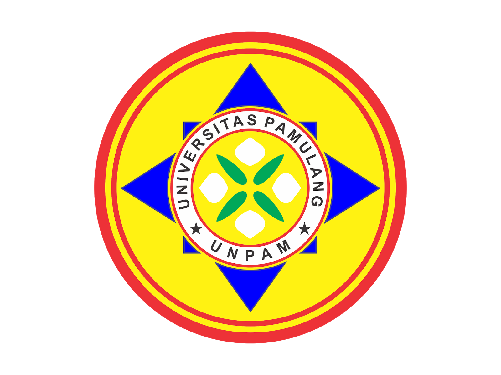
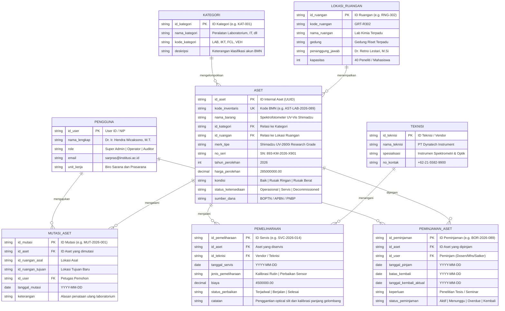
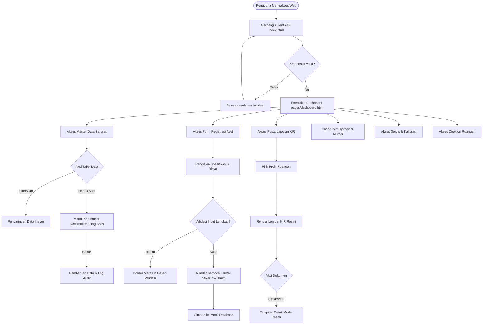

<div align="center">



# SISTEM INFORMASI MANAJEMEN SARANA DAN PRASARANA
### (SARPRAS ACADEMIA : INSTITUTIONAL ASSET MANAGEMENT PLATFORM)

**Tugas Mandiri Ke-1 (Project-Based Learning) : Milestone 1 (Pekan Ke-3)**  
**Mata Kuliah:** Pemrograman Web 2 (Client-Side Programming)  
**Program Studi:** Teknik Informatika  
**Fakultas:** Ilmu Komputer  
**Perguruan Tinggi:** Universitas Pamulang (UNPAM)  

---

### Dosen Pengampu:
**FAJAR AGUNG NUGROHO S.Kom, M.Kom**

---

[](https://www.figma.com/design/2AFWN3pMNSClSdg1beB2za/SARPRAS---Admin-Panel-Design-System---High-Fi-UI?node-id=0-1&t=bAFoQfAKXEWJhC6k-1)
[](https://stitch.withgoogle.com/projects/3279874328774814817)
[](https://www.figma.com/board/KZoXT7K9wnRKsp91X45Gpu)
[](https://github.com/HeinrichRaxwell/Sistem-Manajemen-Sarana-dan-Prasarana-Asset-Management-)

</div>

---

## DAFTAR ISI

1. [Identitas Tugas dan Akademik](#1-identitas-tugas-dan-akademik)
2. [Deskripsi Proyek](#2-deskripsi-proyek)
3. [Tautan Publik Rancangan Sistem (Milestone 1)](#3-tautan-publik-rancangan-sistem-milestone-1)
4. [Ketentuan Tema Visual : Arsitektur Glassmorphism](#4-ketentuan-tema-visual--arsitektur-glassmorphism)
5. [Cakupan Modul Antarmuka (8 Modul Lengkap)](#5-cakupan-modul-antarmuka-8-modul-lengkap)
6. [Arsitektur Informasi dan Hirarki Menu](#6-arsitektur-informasi-dan-hirarki-menu)
7. [Pemodelan Data Relasional (ER-D Mermaid.js)](#7-pemodelan-data-relasional-er-d-mermaidjs)
8. [Diagram Alur Pengguna (User Flow)](#8-diagram-alur-pengguna-user-flow)
9. [Design System Awal dan Token Visual (Figma)](#9-design-system-awal-dan-token-visual-figma)
10. [Struktur Direktori Proyek](#10-struktur-direktori-proyek)
11. [Panduan Menjalankan Aplikasi Secara Lokal](#11-panduan-menjalankan-aplikasi-secara-lokal)
12. [Tahapan Pelaksanaan Proyek (Roadmap Milestone)](#12-tahapan-pelaksanaan-proyek-roadmap-milestone)

---

## 1. IDENTITAS TUGAS DAN AKADEMIK

Dokumentasi ini disusun sebagai laporan resmi pemenuhan tugas perkuliahan berbasis proyek (Project-Based Learning) untuk mata kuliah **Pemrograman Web 2 (Client-Side Programming)** pada Program Studi Teknik Informatika, Fakultas Ilmu Komputer, Universitas Pamulang.

* **Nama Sistem:** Sistem Informasi Manajemen Sarana dan Prasarana (SARPRAS ACADEMIA)
* **Topik Sistem:** Sistem Manajemen Sarana dan Prasarana (Asset Management)
* **Target Utama:** Merancang dan mengimplementasikan antarmuka (User Interface) Halaman Admin Panel yang responsif, interaktif, dan informatif menggunakan teknologi Client-Side (HTML5, CSS3, JavaScript ES6+).
* **Dosen Pengampu:** FAJAR AGUNG NUGROHO S.Kom, M.Kom
* **Fokus Milestone 1 (Pekan Ke-3):** 
  1. Perencanaan Menu dan Informasi Tekstual (`docs/perancangan.md` dan `PERANCANGAN.md`)
  2. Konsep pemodelan data relasional sederhana (ER-D 3NF) menggunakan sintaks Mermaid.js
  3. UI Wireframing dan eksplorasi tata letak komponen di Google Stitch
  4. Penyusunan Design System awal (Color Palettes, Typography Styles, Reusable Components) di Figma
  5. Perancangan High-Fidelity UI untuk seluruh modul utama di Figma

---

## 2. DESKRIPSI PROYEK

**SARPRAS ACADEMIA** adalah platform Back-Office Admin Panel institusional yang dirancang khusus untuk memenuhi standar tata kelola sarana dan prasarana perguruan tinggi serta instansi pendidikan negeri/swasta. Sistem ini mengintegrasikan pengawasan seluruh siklus hidup aset, mulai dari:

1. **Penerimaan dan Registrasi Barang Milik Negara (BMN):** Penatausahaan nomor registrasi NUP, spesifikasi teknis, kapitalisasi perolehan dana, dan pencetakan stiker barcode termal 75x50mm.
2. **Sirkulasi Peminjaman dan Pemakaian Fasilitas:** Pengawasan peminjaman alat bergerak (drone, proyektor, peralatan lab) dan izin penggunaan aula atau smart classroom dengan notifikasi jatuh tempo.
3. **Pemeliharaan dan Kalibrasi Alat Presisi:** Manajemen tiket Work Orders (WO) servis alat dan kalibrasi rutin sesuai standar akreditasi laboratorium ISO/IEC 17025.
4. **Penerbitan Dokumen Resmi Kartu Inventaris Ruangan (KIR):** Pembuatan dokumen fisik berstandar kementerian untuk ditempel pada pintu laboratorium, lengkap dengan blok pengesahan tanda tangan digital ganda terverifikasi QR SHA-256.

Sistem berjalan murni pada arsitektur **Client-Side Programming** dengan pemanfaatan media penyimpanan modern browser (`localStorage`), sehingga tidak memerlukan ketergantungan server backend yang kompleks untuk keperluan simulasi dan demonstrasi akademis.

---

## 3. TAUTAN PUBLIK RANCANGAN SISTEM (MILESTONE 1)

Seluruh rancangan antarmuka dan diagram arsitektur telah dipublikasikan dan dapat diakses langsung oleh dosen pengampu melalui tautan resmi di bawah ini:

| Media / Platform | Deskripsi Artefak | Tautan Akses Publik Langsung |
|---|---|---|
| **Figma High-Fidelity UI & Design System** | Berkas Desain 9 Frames Lengkap (Tokens, Dashboard, Data Master, Form, KIR, Peminjaman, Servis, Ruangan, Login) | [Buka Proyek Figma SARPRAS UI Kit](https://www.figma.com/design/2AFWN3pMNSClSdg1beB2za/SARPRAS---Admin-Panel-Design-System---High-Fi-UI?node-id=0-1&t=bAFoQfAKXEWJhC6k-1) |
| **Google Stitch UI Workspace** | Proyek UI Wireframing dan Screen Generation 8 Modul Lengkap | [Buka Proyek Google Stitch Workspace](https://stitch.withgoogle.com/projects/3279874328774814817) |
| **FigJam Diagram Board** | Diagram Relasional Data (ER-D 3NF) dan Diagram Alur Pengguna (User Flow) | [Buka FigJam Board Diagram](https://www.figma.com/board/KZoXT7K9wnRKsp91X45Gpu) |
| **Dokumentasi Lengkap (.md)** | Spesifikasi Rinci Arsitektur dan Dokumen Perancangan Milestone 1 | Tersedia pada `docs/perancangan.md` dan `PERANCANGAN.md` |

---

## 4. KETENTUAN TEMA VISUAL : ARSITEKTUR GLASSMORPHISM

Sesuai instruksi tugas untuk menerapkan salah satu ketentuan estetika arsitektur UI (*Material Design, Glassmorphism, Skeuomorphism, Neumorphism*), sistem ini memilih dan menerapkan **Glassmorphism (Modern Institutional Glassmorphism)**.

### Karakteristik Fisika Optik yang Diterapkan:
* **Kanvas Carbon Void (`#08090A`):** Latar belakang hitam karbon absolut yang memberikan kontras maksimal serta kenyamanan membaca bagi staf administrasi dan auditor.
* **Permukaan Kaca Buram (Frosted Glass Substrate):** Panel kartu menggunakan warna `#0D0F12` dengan transparansi optik dan efek `backdrop-filter: blur(20px) saturate(180%)`.
* **Refleksi Garis Batas (Specular Border Highlight):** Garis batas 1px `rgba(255, 255, 255, 0.08)` dengan bias kilau specular atas `rgba(255, 255, 255, 0.16)` yang memberikan kesan kedalaman fisik nyata.
* **Solid White Contrast Action:** Tombol tindakan utama menggunakan warna Solid White `#FFFFFF` dengan teks gelap `#08090A` untuk hierarki interaksi yang tegas.
* **Subdued Condition Signals:** Sinyal status kondisi menggunakan palet warna terkalibrasi: Emerald `#059669` (Baik), Amber `#D97706` (Perawatan), dan Crimson `#DC2626` (Rusak Berat).

---

## 5. CAKUPAN MODUL ANTARMUKA (8 MODUL LENGKAP)

Seluruh 8 modul operasional telah dirancang lengkap dalam format High-Fidelity di Google Stitch dan Figma:

| No | Modul Antarmuka | Berkas Halaman | Rincian Fitur Utama |
|---|---|---|---|
| 1 | **Gerbang Autentikasi** | `index.html` | Form login kredensial NIP, proteksi kata sandi, dan integrasi SSO Kemendikbudristek |
| 2 | **Executive Dashboard** | `pages/dashboard.html` | Asymmetric Bento Grid, valuasi Rp 4.85 Miliar, integritas 86.4%, dan jadwal kalibrasi lab |
| 3 | **Master Data Sarpras** | `pages/data-master.html` | Data grid inventaris berdensitas tinggi, filter multi-kategori, dan modal konfirmasi hapus BMN |
| 4 | **Form Registrasi Aset** | `pages/form.html` | Form 2-kolom spesifikasi teknis, kalkulasi nilai buku, dan live barcode termal stiker 75x50mm |
| 5 | **Pusat Laporan & KIR** | `pages/laporan.html` | Lembar resmi Kartu Inventaris Ruangan standar kementerian dengan tanda tangan digital ganda |
| 6 | **Pusat Peminjaman** | `pages/peminjaman.html` | Sirkulasi barang bergerak, izin aula, pelacakan tanggal jatuh tempo, dan deteksi keterlambatan |
| 7 | **Servis & Kalibrasi** | `pages/maintenance.html` | Manajemen tiket Work Orders (WO), kalibrasi ISO/IEC 17025, dan monitoring vendor rekanan |
| 8 | **Direktori Ruangan** | `pages/ruangan.html` | Profil 6 ruangan kampus, kapasitas mahasiswa, penanggung jawab, dan akses cepat dokumen KIR |

### Galeri Tangkapan Layar Rancangan (Stitch & Figma High-Resolution)

<div align="center">

#### 1. Gerbang Autentikasi Admin (`index.html`)


#### 2. Executive Command Dashboard (`pages/dashboard.html`)


#### 3. Master Data Sarana dan Prasarana (`pages/data-master.html`)


#### 4. Form Registrasi Aset Baru (`pages/form.html`)


#### 5. Pusat Laporan & Kartu Inventaris Ruangan / KIR (`pages/laporan.html`)


#### 6. Pusat Peminjaman & Mutasi Fasilitas (`pages/peminjaman.html`)


#### 7. Manajemen Servis & Kalibrasi Alat (`pages/maintenance.html`)


#### 8. Direktori Fasilitas Gedung & Ruangan (`pages/ruangan.html`)


</div>

---

## 6. ARSITEKTUR INFORMASI DAN HIRARKI MENU

Hierarki antarmuka terbagi menjadi dua bagian utama, yaitu rel navigasi vertikal (Sidebar Rail) dan bilah kendali horizontal (Top Command Bar):

```
[SARPRAS ACADEMIA - ADMIN PANEL]
├── 0. Gerbang Autentikasi (index.html)
├── 1. Executive Dashboard (pages/dashboard.html)
├── 2. Master Data Sarana dan Prasarana (pages/data-master.html)
├── 3. Form Registrasi Aset Baru (pages/form.html)
├── 4. Pusat Laporan & Kartu Inventaris Ruangan / KIR (pages/laporan.html)
├── 5. Pusat Peminjaman & Mutasi Fasilitas (pages/peminjaman.html)
├── 6. Manajemen Servis & Kalibrasi Alat (pages/maintenance.html)
└── 7. Direktori Fasilitas Gedung & Ruangan (pages/ruangan.html)
```

---

## 7. PEMODELAN DATA RELASIONAL (ER-D MERMAID.JS)

Perancangan entitas basis data dirancang dalam bentuk Third Normal Form (3NF) yang terdiri dari 8 tabel relasional yang saling terhubung:



---

## 8. DIAGRAM ALUR PENGGUNA (USER FLOW)

Alur penjelajahan operasional admin panel dari autentikasi hingga pengesahan laporan:



---

## 9. DESIGN SYSTEM AWAL DAN TOKEN VISUAL (FIGMA)

Seluruh token visual terstandarisasi pada **Frame 00 di Figma** dan digunakan sebagai acuan baku slicing CSS di Milestone 2:

### Palet Warna Semantik (Color Palettes)
* `--color-canvas`: `#08090A` (Carbon Void, latar utama viewport)
* `--color-surface`: `#0D0F12` (Permukaan panel kartu kaca buram)
* `--color-text-primary`: `#EDEDED` (Chalk White, rasio kontras 15.8:1 AAA)
* `--color-text-secondary`: `#71717A` (Muted Zinc, rasio kontras 4.9:1 AA)
* `--color-primary-cta`: `#FFFFFF` (Solid White untuk tombol aksi utama)
* `--color-accent-cobalt`: `#2563EB` (Precision Cobalt untuk fokus form dan link NUP)
* `--color-signal-normal`: `#059669` (Subdued Emerald, kondisi prima)
* `--color-signal-warning`: `#D97706` (Subdued Amber, antrean servis)
* `--color-signal-critical`: `#DC2626` (Subdued Crimson, kondisi rusak berat)
* `--color-whisper-border`: `rgba(255, 255, 255, 0.08)` (Garis batas panel 1px)

### Tipografi
* **Font Antarmuka Umum:** `Inter`, `-apple-system`, `BlinkMacSystemFont`, `sans-serif`
* **Font Kode dan Numerik:** `JetBrains Mono`, `Consolas`, `monospace`

---

## 10. STRUKTUR DIREKTORI PROYEK

Struktur folder proyek ditata secara rapi sesuai format baku pengumpulan tugas Pemrograman Web 2:

```
Sistem-Manajemen-Sarana-dan-Prasarana-Asset-Management-/
├── docs/
│   └── perancangan.md                  <-- Dokumen Teknis Lengkap Milestone 1
├── PERANCANGAN.md                      <-- Salinan Dokumen Teknis pada Root
├── README.md                           <-- Laporan Resmi Proyek & Panduan Repositori
├── assets/
│   ├── css/                            <-- Lembar Gaya CSS (Slicing Milestone 2)
│   ├── js/                             <-- Logika Interaktivitas & Mock Data (Milestone 3)
│   └── img/                            <-- Aset Visual, Logo UNPAM, & 8 Screenshot Stitch
│       ├── logo_unpam.png
│       ├── stitch_login.png
│       ├── stitch_dashboard.png
│       ├── stitch_datamaster.png
│       ├── stitch_form.png
│       ├── stitch_laporan.png
│       ├── stitch_peminjaman.png
│       ├── stitch_maintenance.png
│       └── stitch_ruangan.png
└── pages/                              <-- Halaman Spesifik Sistem (Milestone 2 & 3)
```

---

## 11. PANDUAN MENJALANKAN APLIKASI SECARA LOKAL

Aplikasi ini dibangun menggunakan arsitektur web client-side murni (tanpa dependensi build tool berat atau server database), sehingga dapat dijalankan dengan sangat mudah di komputer lokal:

### 1. Kloning Repositori Git
```bash
git clone https://github.com/HeinrichRaxwell/Sistem-Manajemen-Sarana-dan-Prasarana-Asset-Management-.git
cd Sistem-Manajemen-Sarana-dan-Prasarana-Asset-Management-
```

### 2. Menjalankan dengan Local Web Server
Pilih salah satu metode berikut:

* **Menggunakan Python (Bawaan Windows/Mac/Linux):**
  ```bash
  python -m http.server 3000
  ```
  Lalu buka peramban di `http://localhost:3000`

* **Menggunakan Node.js (npx serve):**
  ```bash
  npx serve .
  ```

* **Menggunakan VS Code Live Server:**
  Cukup klik kanan pada berkas `index.html` lalu pilih **Open with Live Server**.

---

## 12. TAHAPAN PELAKSANAAN PROYEK (ROADMAP MILESTONE)

* [x] **Milestone 1 (Pekan Ke-3) : Perencanaan Menu, ER-D dan UI Wireframing**
  * Perencanaan arsitektur menu dan dokumen `PERANCANGAN.md`
  * Pemodelan relasi data Mermaid.js (8 Entitas 3NF)
  * UI Wireframing 8 modul lengkap di Google Stitch
  * Pembuatan Design System dan High-Fidelity UI di Figma (9 Frames)
  * Publikasi repositori GitHub dan verifikasi tautan publik
* [ ] **Milestone 2 (Pekan Ke-5) : Slicing dan Layouting Dasar (HTML5 & CSS3)**
  * Penerjemahan token visual Figma ke variabel CSS Glassmorphism
  * Pembuatan struktur dasar Master Template `layout.html` (Sidebar, Header, Content, Footer)
  * Pengujian responsivitas layout desktop, tablet, dan mobile
* [ ] **Milestone 3 (Pekan Ke-7) : Implementasi Komponen dan Interaktivitas UI (JavaScript)**
  * Pembuatan 4 halaman inti spesifik (Dashboard, Data Master, Form, Laporan)
  * Integrasi grafik visual Chart.js pada Dashboard
  * Validasi input form interaktif dan generator barcode label
  * Manipulasi data mock (CRUD) pada media `localStorage`
  * Demonstrasi langsung dan hosting publik di Vercel / GitHub Pages

---

<div align="center">
  <b>Universitas Pamulang (UNPAM)</b><br/>
  Program Studi Teknik Informatika, Fakultas Ilmu Komputer<br/>
  Mata Kuliah Pemrograman Web 2 (Client-Side Programming)<br/>
  Tahun Akademik 2025/2026
</div>
