# DOKUMEN PERANCANGAN SISTEM INFORMASI (MILESTONE 1)
# SARPRAS ACADEMIA : SISTEM MANAJEMEN SARANA DAN PRASARANA
## SPESIFIKASI ARSITEKTUR INFORMASI, DESIGN SYSTEM GLASSMORPHISM DAN UI WIREFRAMING

---

**Mata Kuliah:** Pemrograman Web 2 (Client-Side Programming)  
**Bobot Tugas:** Tugas Ke-1 (Project-Based Learning)  
**Milestone:** 1 (Pekan Ke-3) : Perencanaan Menu, ER-D dan UI Wireframing  
**Topik Terpilih:** Sistem Manajemen Sarana dan Prasarana (Asset Management)  
**Ketentuan Tema Visual:** Glassmorphism (Modern Institutional Glassmorphism)  

---

## 1. TAUTAN PUBLIK RANCANGAN SISTEM

Sesuai dengan ketentuan Milestone 1, seluruh rancangan visual antarmuka dan diagram alur sistem dapat diakses secara publik melalui tautan resmi berikut:

* **Tautan Publik Figma (Design System dan High-Fidelity UI 8 Modul Lengkap):**  
  [https://www.figma.com/design/2AFWN3pMNSClSdg1beB2za/SARPRAS---Admin-Panel-Design-System---High-Fi-UI?node-id=0-1&t=bAFoQfAKXEWJhC6k-1](https://www.figma.com/design/2AFWN3pMNSClSdg1beB2za/SARPRAS---Admin-Panel-Design-System---High-Fi-UI?node-id=0-1&t=bAFoQfAKXEWJhC6k-1)
* **Tautan Publik Google Stitch (Proyek UI Wireframing dan Screen Generation):**  
  [https://stitch.withgoogle.com/projects/3279874328774814817](https://stitch.withgoogle.com/projects/3279874328774814817)
* **Tautan Publik FigJam (Diagram Relasional ER-D dan User Flow):**  
  [https://www.figma.com/board/KZoXT7K9wnRKsp91X45Gpu](https://www.figma.com/board/KZoXT7K9wnRKsp91X45Gpu)

---

## 2. LANDASAN TEORI DAN JUSTIFIKASI PENERAPAN TEMA GLASSMORPHISM

Berdasarkan ketentuan panduan tugas, mahasiswa diwajibkan memilih salah satu dari 4 ketentuan estetika dan arsitektur UI:
1. Material Design
2. **Glassmorphism** (Pilihan yang Diimplementasikan)
3. Skeuomorphism
4. Neumorphism

### 2.1 Alasan Pemilihan Glassmorphism
Sistem Manajemen Sarana dan Prasarana (SARPRAS ACADEMIA) mengelola ribuan aset barang milik negara (BMN) dan institusi akademik bernilai miliaran rupiah. Antarmuka sistem ini menuntut visual yang modern, elegan, adaptif, serta mampu menyajikan densitas informasi tinggi tanpa menimbulkan kelelahan visual (visual fatigue). 

Glassmorphism dipilih karena keunggulannya dalam menciptakan hierarki kedalaman (depth hierarchy) multi-dimensi melalui permukaan optik semi-transparan. Berbeda dengan Neumorphism yang memiliki isu kontras rendah atau Material Design konvensional yang cenderung datar, Glassmorphism menghadirkan kesan mewah, futuristik, dan berwibawa layaknya sistem operasi modern kelas dunia.

### 2.2 Karakteristik Arsitektur Glassmorphism yang Diterapkan
Sistem ini menerapkan prinsip fisika optik kaca buram (frosted glass) yang terdiri dari lima lapisan visual terukur:

1. **Kanvas Latar Belakang (Base Substrate):**  
   Menggunakan warna dasar Carbon Void `#08090A` yang netral dan pekat, dipadukan dengan aksen pendaran cahaya ambient tersembunyi bergradasi halus (radial ambient glow). Hal ini memberikan kontras maksimum bagi seluruh panel kaca di atasnya.
2. **Permukaan Kaca Buram (Frosted Glass Panel):**  
   Lapisan panel kartu menggunakan warna `#0D0F12` dengan transparansi halus serta efek filter pemburaman latar belakang `backdrop-filter: blur(20px) saturate(180%)`. Hal ini membuat elemen di belakang panel tampak buram secara realistis tanpa mengorbankan keterbacaan teks.
3. **Refleksi Garis Batas (Specular Border Highlight):**  
   Setiap kartu dan kontainer kaca dibingkai oleh garis batas (border) 1px `rgba(255, 255, 255, 0.08)` dengan pantulan cahaya specular di tepi atas `rgba(255, 255, 255, 0.16)` yang menyerupai sudut pantulan kaca kristal terasah.
4. **Tipografi Berkontras Tinggi (High-Contrast Typography):**  
   Teks utama menggunakan warna Chalk White `#EDEDED` (rasio kontras 15.8:1, melampaui standar WCAG AAA) dan teks sekunder menggunakan Muted Zinc `#71717A`. Seluruh nomor register BMN, nomor seri, dan valuasi keuangan disajikan menggunakan font monospace `JetBrains Mono` untuk presisi audit.
5. **Indikator Sinyal Subdued:**  
   Warna status kondisi aset menggunakan palet warna terkalibrasi: Emerald `#059669` untuk kondisi baik, Amber `#D97706` untuk pemeliharaan, dan Crimson `#DC2626` untuk kerusakan kritis, masing-masing dengan latar belakang pendaran tipis (12% opacity).

---

## 3. HIRARKI MENU DAN ARSITEKTUR INFORMASI (SITEMAP)

Arsitektur informasi dirancang mengikuti alur kerja operasional pengelolaan aset institusi, mulai dari perencanaan, registrasi pengadaan, sirkulasi peminjaman, pemeliharaan berkala, hingga pelaporan audit dan penghapusan aset.

### 3.1 Struktur Navigasi Antarmuka

```
[SARPRAS ACADEMIA - ADMIN PANEL]
├── 0. Gerbang Autentikasi (index.html)
│   ├── Login Kredensial NIP / Akun
│   ├── Pemulihan Kata Sandi
│   └── Integrasi SSO Kemendikbudristek
│
├── 1. Executive Dashboard (pages/dashboard.html)
│   ├── Ringkasan Metrik Valuasi Fiskal & Kesehatan Operasional
│   ├── Disposisi Tiket Pemeliharaan & Kalibrasi Kritis
│   ├── Distribusi Alokasi Aset per Kluster Fasilitas
│   └── Tabel Jadwal Kalibrasi Mendatang & Aksi Cepat
│
├── 2. Master Data Sarana dan Prasarana (pages/data-master.html)
│   ├── Ringkasan Total Unit, Valuasi, Unit Prima, & Servis
│   ├── Toolbar Pencarian Global, Filter Multi-Kategori & Lokasi
│   ├── Tabel Inventaris BMN Berdensitas Tinggi (Kode NUP, Spesifikasi, Nilai)
│   ├── Paginasi Data Terstruktur
│   └── Modal Konfirmasi Penghapusan / Decommissioning Aset BMN
│
├── 3. Form Registrasi Aset Baru (pages/form.html)
│   ├── Identitas Sarana (Nama, Merk, Nomor Seri, Kategori BMN)
│   ├── Penempatan Spasial (Gedung, Lantai, Nomor Ruangan)
│   ├── Penilaian Kondisi Fisik Penerimaan Awal
│   ├── Nilai Kapitalisasi Fiskal & Dropzone Bukti Berkas BAST
│   └── Generator & Pratinjau Langsung Stiker Barcode/QR Termal (75x50mm)
│
├── 4. Pusat Laporan & Kartu Inventaris Ruangan / KIR (pages/laporan.html)
│   ├── Ringkasan Kepatuhan Fisik Ruangan Terpilih
│   ├── Format Dokumen Resmi KIR Berstandar Kementerian
│   ├── Tabel Rincian Inventaris Laboratorium & Ruang Kerja
│   ├── Blok Pengesahan Digital Ganda (Direktur & Penanggung Jawab Ruangan)
│   └── Ekspor Dokumen Resmi (PDF Siap Cetak & Spreadsheet)
│
├── 5. Pusat Peminjaman & Mutasi Fasilitas (pages/peminjaman.html)
│   ├── Sirkulasi Peminjaman Sarana Bergerak & Izin Ruang Kuliah/Aula
│   ├── Pengawasan Tenggat Pengembalian & Deteksi Jatuh Tempo (Overdue)
│   ├── Alur Persetujuan Peminjaman & Penerbitan SP-1
│   └── Pencatatan Mutasi Fisik Antar-Ruangan & BAST Mutasi
│
├── 6. Manajemen Servis & Kalibrasi Alat (pages/maintenance.html)
│   ├── Manajemen Tiket Work Orders (WO) Pemeliharaan
│   ├── Kalender Kalibrasi Berkala Standar Akreditasi ISO/IEC 17025
│   ├── Pelacakan Realisasi Anggaran Servis DIPA
│   └── Evaluasi SLA Kinerja Rekanan Vendor BMN
│
└── 7. Direktori Fasilitas Gedung & Ruangan (pages/ruangan.html)
    ├── Pemetaan Zonasi Kampus (Sains, Teknologi, Rektorat, Smart Class)
    ├── Matriks Kartu Profil Ruangan (Kapasitas, Luas Lantai, Suhu, Valuasi)
    ├── Identitas Dosen / Tenaga Kependidikan Penanggung Jawab Ruangan
    └── Akses Cepat Penerbitan Dokumen KIR per Ruangan
```

### 3.2 Matriks Hak Akses Pengguna (Role-Based Access Control)

| Modul Antarmuka | Super Admin (Biro Sarpras) | Operator Fakultas / Lab | Teknisi / Rekanan BMN | Auditor BPK / Inspektorat |
|---|---|---|---|---|
| **Dashboard Eksekutif** | Akses Penuh & Analitik | Ringkasan Unit Terkait | Tiket Servis Terkait | Read-Only Audit View |
| **Master Data Sarpras** | Kelola, Tambah, Edit, Hapus | Lihat & Usul Koreksi | Lihat Spesifikasi Alat | Verifikasi & Pemeriksaan |
| **Form Registrasi** | Input & Otorisasi NUP BMN | Input Draf Aset Baru | Tidak Memiliki Akses | Read-Only Verifikasi BAST |
| **Laporan & Dokumen KIR** | Terbitkan, Cetak, Sahkan | Cetak Lembar Ruangan | Tidak Memiliki Akses | Validasi & Unduh Laporan |
| **Peminjaman & Mutasi** | Otorisasi & Disposisi | Input Permohonan Pinjam | Tidak Memiliki Akses | Pantau Riwayat Sirkulasi |
| **Servis & Kalibrasi** | Alokasi Anggaran & Vendor | Laporkan Kerusakan Alat | Update Progres & Uji | Audit Kepatuhan Kalibrasi |
| **Direktori Ruangan** | Kelola Gedung & PIC Ruang | Update Profil Ruang | Lihat Penempatan Alat | Audit Densitas Sarana |

---

## 4. PEMODELAN DATA RELASIONAL (ER-D MERMAID.JS)

Struktur data sarana dan prasarana dirancang dalam format relasional normalisasi tahap ketiga (Third Normal Form / 3NF). Seluruh relasi ini disiapkan agar dapat diimplementasikan dengan mulus pada media penyimpanan client-side (`localStorage` / JSON state) pada Milestone berikutnya.

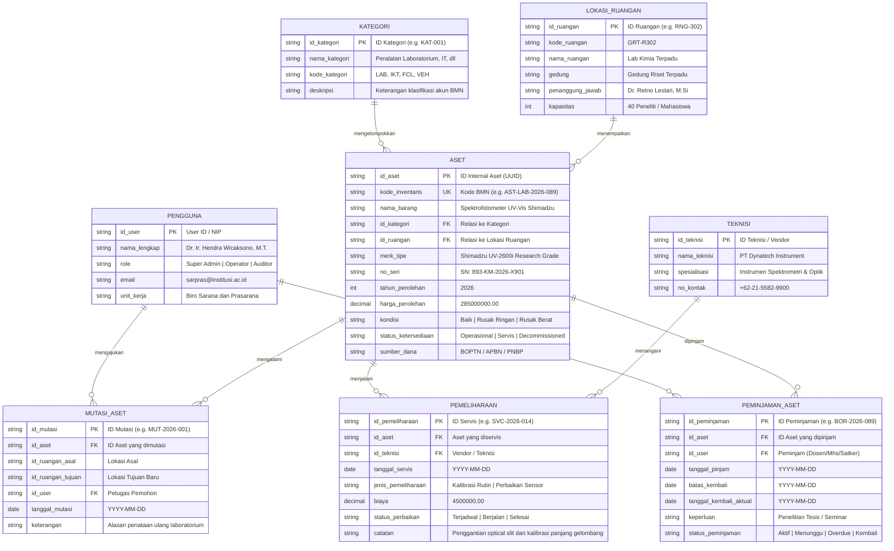

---

## 5. DIAGRAM ALUR PENGGUNA (USER FLOW) DAN SIKLUS HIDUP ASET

### 5.1 Alur Navigasi Global Admin

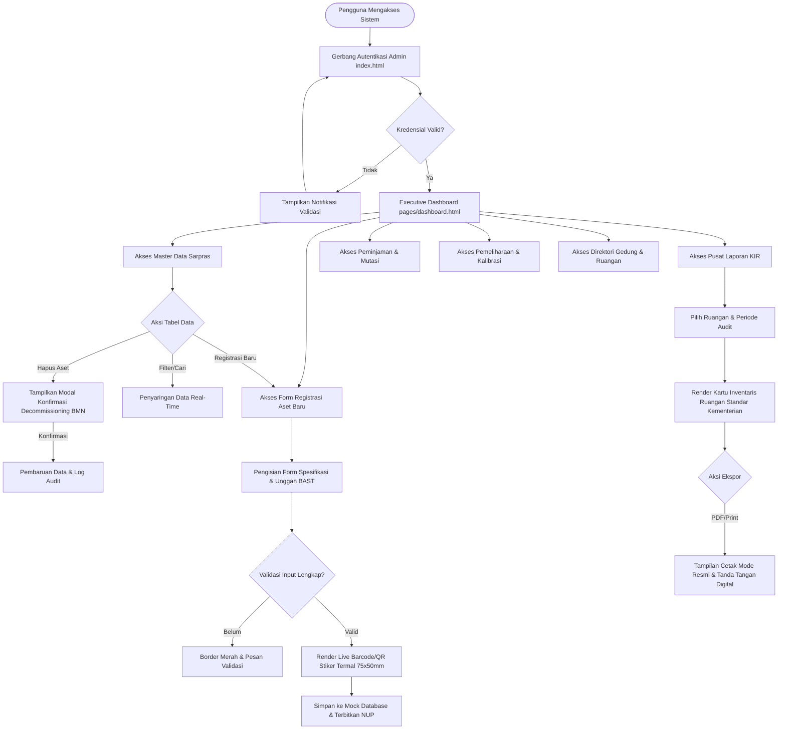

### 5.2 Siklus Hidup Aset (Asset Lifecycle State Machine)

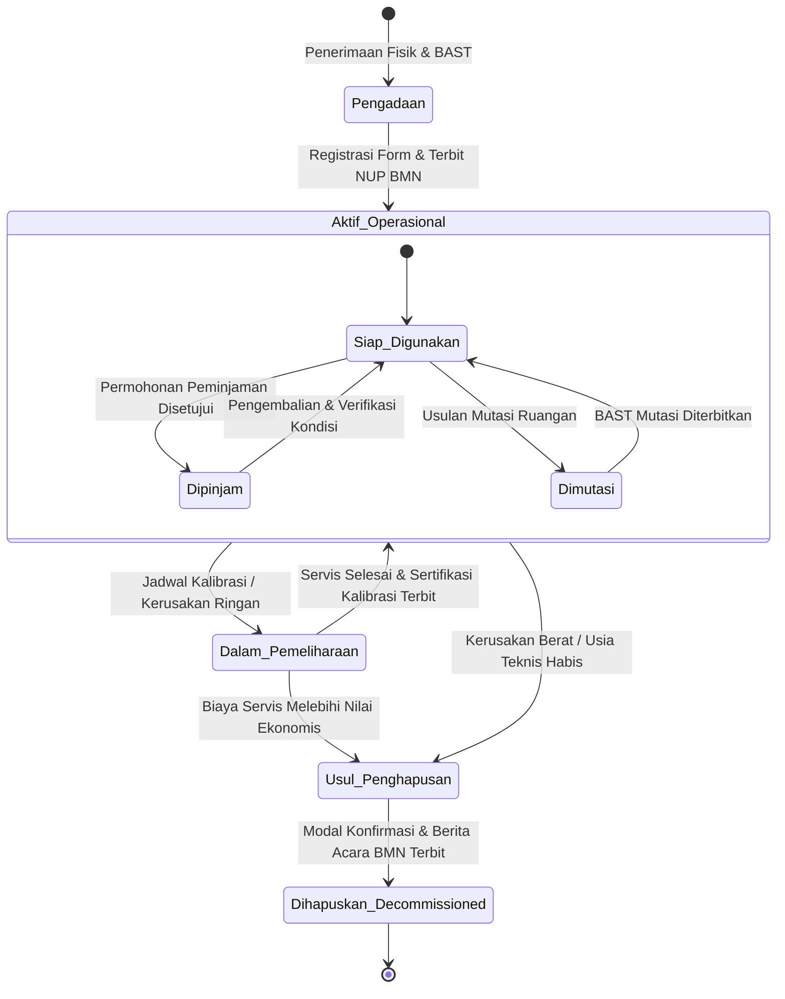

---

## 6. SPESIFIKASI DETAIL 8 MODUL HALAMAN DAN DOKUMENTASI WIREFRAME

Setiap halaman telah dirancang dengan presisi visual beresolusi tinggi di Google Stitch dan Figma dengan pendekatan Glassmorphism terstandarisasi. Berikut rincian fungsional dan visualnya:

### 6.1 Gerbang Autentikasi Admin (`index.html`)

Halaman gerbang masuk sistem yang mengamankan hak akses administratif. Menggunakan kartu kaca buram melayang di tengah kanvas gelap, dengan bidang input kredensial NIP, proteksi passkey, tombol masuk solid white, serta integrasi identitas tunggal SSO Kemendikbudristek.

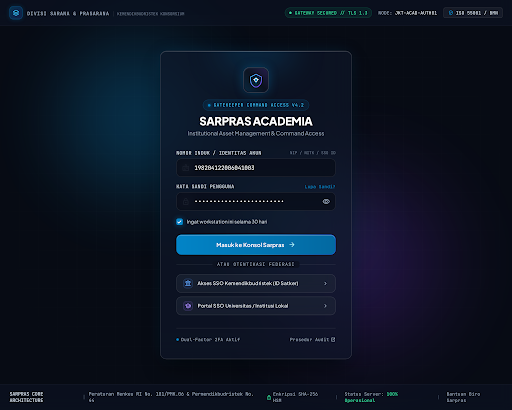

* **Komponen Utama:** Kartu Frosted Glass (Lebar 460px, Radius 8px), Form Input NIP Monospace, Field Password dengan Toggle Sandi, Tombol Masuk Solid White `#FFFFFF`, dan Tombol Masuk Alternatif Akun Belajar.id.
* **Interaktivitas:** Validasi format NIP di sisi klien, animasi feedback penekanan tombol (`scale 0.98`), dan peringatan keamanan TLS 1.3 terenkripsi.

---

### 6.2 Executive Command Dashboard (`pages/dashboard.html`)

Halaman pusat komando eksekutif pimpinan universitas dan pengelola sarpras. Menyajikan telemetri valuasi total aset, status kesehatan operasional, antrean pemeliharaan terjadwal, dan distribusi aset lintas gedung.

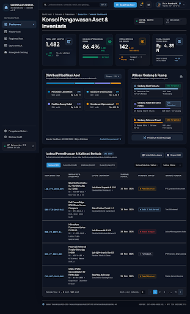

* **Komponen Utama:** Asymmetric Bento Grid (Sel Valuasi Fiskal Rp 4.85 Miliar & Gauge Kesehatan 86.4%, Sel Disposisi Servis 142 Tiket, Sel Alokasi Kluster 4 Bar), dan Tabel Data Jadwal Kalibrasi 5 Baris Lengkap.
* **Interaktivitas:** Filter tab kategori instrumen, tombol ekspor cepat data XLSX, dan indikator denyut status sistem (System Nominal Beacon).

---

### 6.3 Master Data Sarana dan Prasarana (`pages/data-master.html`)

Halaman katalog dan inventarisasi utama seluruh sarana dan prasarana institusi. Dilengkapi fitur pencarian multi-kriteria, filter kategori dan gedung, serta komponen modal konfirmasi penghapusan aset BMN.

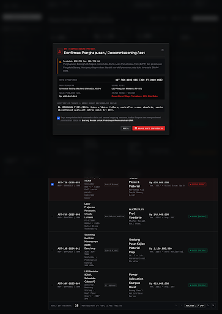

* **Komponen Utama:** 4 Kartu Metrik Ringkas, Toolbar Pencarian Global (`Ctrl + K`), Filter Dropdown Kategori dan Lokasi Gedung, Tabel Inventaris Densitas Tinggi (Kolom: Kode Aset, Nama Spesifikasi, Kategori, Lokasi, Nilai Buku, Kondisi, Aksi), Paginasi Terstruktur, dan Modal Konfirmasi Decommissioning BMN.
* **Interaktivitas:** Filter data tabel instan di sisi klien tanpa reload halaman, pemunculan modal konfirmasi dengan latar belakang blur 28px, dan aksi penghapusan baris data.

---

### 6.4 Form Registrasi Aset Baru (`pages/form.html`)

Formulir pencatatan dan kapitalisasi sarana baru hasil pengadaan atau hibah institusi. Menghubungkan input data teknis dengan kalkulasi fiskal dan generator label stiker termal otomatis.

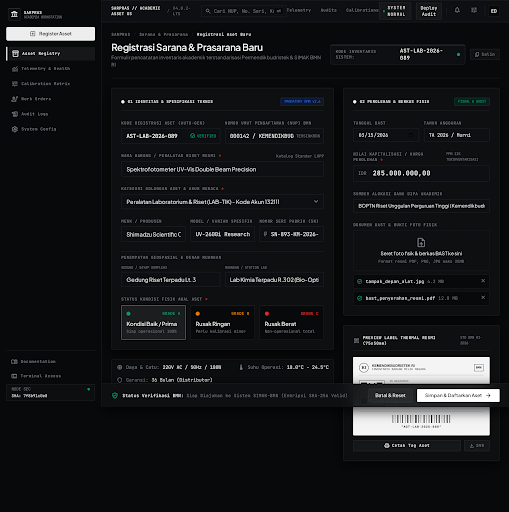

* **Komponen Utama:** Tata Letak 2-Kolom (Kolom Kiri: Kode NUP Otomatis, Nama Aset, Dropdown Kategori BMN, Penempatan Gedung/Ruang, dan 3 Kartu Radio Pilihan Kondisi Fisik. Kolom Kanan: Nilai Perolehan Rupiah Terformat, Dropzone Bukti Berkas BAST, serta Kotak Pratinjau Stiker Termal Barcode/QR 75x50mm Siap Cetak).
* **Interaktivitas:** Validasi real-time kolom wajib isi (required), pemformatan otomatis mata uang Rupiah, dan tombol cetak label termal langsung.

---

### 6.5 Pusat Laporan & Kartu Inventaris Ruangan / KIR (`pages/laporan.html`)

Pusat penerbitan dan validasi dokumen fisik resmi inventarisasi ruangan berstandar regulasi kementerian. Menghasilkan format dokumen KIR yang siap ditandatangani dan dicetak untuk ditempel pada pintu laboratorium atau ruang kantor.

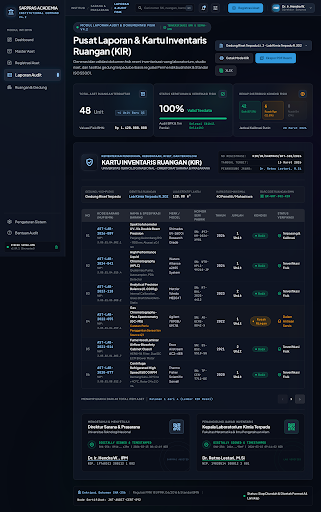

* **Komponen Utama:** 3 Kartu Telemetri Audit, Format Lembar Dokumen Resmi KIR (Kop Kementerian, Nomor Register KIR, Metadata Gedung/Ruangan, Tabel Rincian 6 Aset Laboratorium Utama), serta Blok Tanda Tangan Digital Ganda Terotentikasi Stempel QR SHA-256.
* **Interaktivitas:** Tombol Cetak Mode KIR (CSS print-media stylesheet) dan tombol ekspor dokumen PDF resmi.

---

### 6.6 Pusat Peminjaman & Mutasi Fasilitas (`pages/peminjaman.html`)

Modul sirkulasi operasional sarana bergerak dan izin pemakaian ruang bersama. Mencegah kehilangan aset dan memastikan kepatuhan jadwal pengembalian.

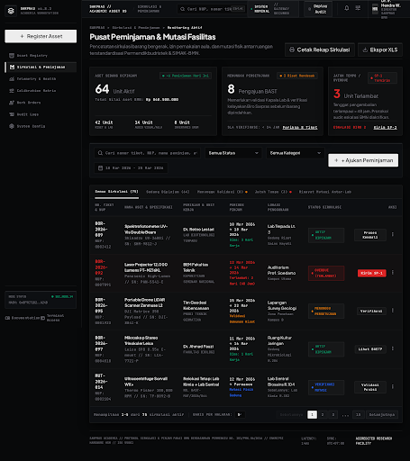

* **Komponen Utama:** 3 Kartu Metrik Sirkulasi (Sesi Pinjam Aktif, Status Terlambat/Overdue, Mutasi Ruangan Disetujui), Tombol White CTA `+ Ajukan Peminjaman`, dan Tabel Data Sirkulasi Peminjaman Lengkap.
* **Interaktivitas:** Filter status peminjaman (Aktif, Menunggu, Terlambat, Selesai) dan aksi verifikasi pengembalian sarana.

---

### 6.7 Manajemen Servis & Kalibrasi Alat (`pages/maintenance.html`)

Pusat kendali perintah kerja (Work Orders) perbaikan fasilitas dan pengawasan akreditasi kalibrasi instrumen presisi tinggi.

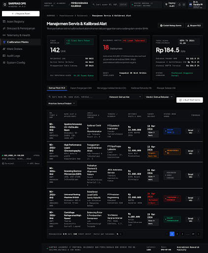

* **Komponen Utama:** 3 Kartu Ringkasan Tiket (Total Tiket Terjadwal, Kritis / Overdue Toleransi Uji, dan Realisasi Anggaran Servis DIPA), Tombol `+ Terbitkan Work Order`, serta Tabel Status Pengerjaan Rekanan Vendor BMN.
* **Interaktivitas:** Pelacakan hitung mundur batas SLA pengerjaan dan pembukaan dokumen Berita Acara Servis.

---

### 6.8 Direktori Fasilitas Gedung & Ruangan (`pages/ruangan.html`)

Katalog spasial seluruh fasilitas fisik kampus yang memetakan persebaran laboratorium terakreditasi, ruang kuliah, dan gedung rektorat.

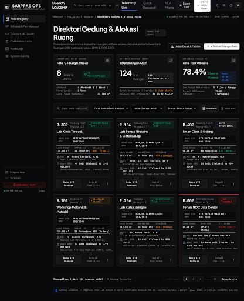

* **Komponen Utama:** 3 Kartu Metrik Infrastruktur (Jumlah Gedung, Total Ruangan Terdata, Total Aset Terdistribusi), serta Grid 6 Kartu Ruangan Modular (Lab Kimia R.302, Data Center Rektorat, Smart Class 401, Lab Biomedik R.105, Workshop FT, Auditorium Graha Nusantara).
* **Interaktivitas:** Kartu interaktif dengan hover elevation dan tombol langsung untuk membuka Lembar Dokumen KIR per ruangan.

---

## 7. DESIGN SYSTEM DAN KOMPONEN REUSABLE (FIGMA DESIGN TOKENS)

Seluruh token visual telah terdefinisi secara kanonikal pada **Frame 00 di Figma** dan menjadi acuan utama tahap slicing kode HTML/CSS di Milestone 2:

### 7.1 Palet Warna Semantik (Color Tokens)

| Token Nama | Nilai HEX / RGBA | Peran Semantik dalam Antarmuka | Rasio Kontras WCAG |
|---|---|---|---|
| `--color-canvas` | `#08090A` | Warna dasar viewport latar belakang utama | Background Induk |
| `--color-surface` | `#0D0F12` | Permukaan panel kartu kaca buram | Card Background |
| `--color-text-primary` | `#EDEDED` | Teks judul, angka metrik, dan data tabel | 15.8:1 (AAA) |
| `--color-text-secondary`| `#71717A` | Label keterangan, placeholder, dan metadata | 4.9:1 (AA) |
| `--color-primary-cta` | `#FFFFFF` | Tombol aksi utama (Solid White kontras tinggi)| 17.2:1 (AAA) |
| `--color-accent-cobalt` | `#2563EB` | Garis fokus form, link NUP, dan tab aktif | Aksen Struktural |
| `--color-signal-normal` | `#059669` | Status kondisi baik (Subdued Emerald) | Sinyal Positif |
| `--color-signal-warning`| `#D97706` | Status dalam pemeliharaan (Subdued Amber) | Sinyal Waspada |
| `--color-signal-critical`| `#DC2626` | Status rusak berat / afkir (Subdued Crimson) | Sinyal Kritis |
| `--color-whisper-border`| `rgba(255, 255, 255, 0.08)` | Garis batas struktural panel kaca (1px Hairline)| Refleksi Bias |

### 7.2 Skala Tipografi (Typography Scale)

* **Font Family Utama:** `Inter`, `-apple-system`, `BlinkMacSystemFont`, `Segoe UI`, `sans-serif` (Optimal untuk UI tabular dan keterbacaan label).
* **Font Family Numerik & Kode:** `JetBrains Mono`, `Consolas`, `monospace` (Wajib untuk NUP BMN, kode serial, dan angka mata uang Rupiah).
* **Display Metric:** 26px / 28px (Bold, tracking -0.02em).
* **Heading 1:** 18px (Bold, tracking -0.01em).
* **Heading 2:** 15px (Semi Bold).
* **Body Regular:** 12px (Regular, line-height 1.5).
* **Data Row / Monospace:** 11px / 12px (Medium / Semi Bold).
* **Caption / Meta Tag:** 9px / 10px (Semi Bold, uppercase, tracking +0.05em).

### 7.3 Komponen Reusable

1. **Tombol Primary (Solid White):** Background `#FFFFFF`, teks `#08090A` Semi Bold, padding 8px 18px, border-radius 4px. Memiliki respon klik mikro `transform: scale(0.97)` pada state `:active`.
2. **Tombol Secondary (Smoked Glass):** Background `rgba(255, 255, 255, 0.04)`, teks `#EDEDED`, border 1px `rgba(255, 255, 255, 0.08)`, border-radius 4px.
3. **Form Input (Recessed Glass):** Background `#08090A`, border 1px `rgba(255, 255, 255, 0.08)`, border-radius 4px, padding 10px 14px, teks `#EDEDED`. Pada status `:focus` garis batas beralih menjadi Cobalt `#2563EB` dengan pendaran tipis.
4. **Status Pill (Subdued Signal Badge):** Border-radius 4px, padding 4px 10px, font 10px Semi Bold monospace, background dengan tingkat transparansi 12% dan garis batas 30% dari warna sinyal bersangkutan.

---

## 8. SKEMA DATA JSON MOCK STORAGE (CLIENT-SIDE READY)

Untuk mendukung Milestone 3 tanpa ketergantungan database server, disiapkan skema data JSON standar yang akan dimuat ke dalam memori client-side (`localStorage`):

```json
[
  {
    "id_aset": "AST-LAB-2026-089",
    "kode_bmn": "3.05.01.04.002.1",
    "nama_barang": "Spektrofotometer UV-Vis Double Beam Precision",
    "kategori": "Peralatan Laboratorium",
    "merk_model": "Shimadzu UV-2600i",
    "nomor_seri": "893-KM-2026-X901",
    "lokasi": {
      "gedung": "Gedung Riset Terpadu",
      "lantai": 3,
      "ruangan": "Lab Kimia Terpadu R.302",
      "penanggung_jawab": "Dr. Retno Lestari, M.Si"
    },
    "tahun_perolehan": 2026,
    "harga_perolehan": 285000000,
    "nilai_buku_saat_ini": 285000000,
    "kondisi": "Baik",
    "status": "Operasional",
    "sumber_dana": "BOPTN TA 2026",
    "jadwal_kalibrasi_berikutnya": "2026-09-18",
    "terakhir_diperiksa": "2026-03-10"
  },
  {
    "id_aset": "AST-TIK-2025-014",
    "kode_bmn": "3.05.02.01.005.2",
    "nama_barang": "Dell PowerEdge R750 Compute Server Node",
    "kategori": "Infrastruktur IT",
    "merk_model": "Dell EMC PowerEdge R750 Dual Xeon",
    "nomor_seri": "DELL-R750-SRV-091",
    "lokasi": {
      "gedung": "Gedung Rektorat",
      "lantai": 1,
      "ruangan": "Data Center & NOC Utama",
      "penanggung_jawab": "Ir. Faisal Akbar, M.Kom"
    },
    "tahun_perolehan": 2025,
    "harga_perolehan": 180000000,
    "nilai_buku_saat_ini": 162000000,
    "kondisi": "Baik",
    "status": "Operasional",
    "sumber_dana": "DIPA PNBP TA 2025",
    "jadwal_kalibrasi_berikutnya": "2026-08-20",
    "terakhir_diperiksa": "2026-03-08"
  }
]
```

---

## 9. KESIMPULAN PERENCANAAN MILESTONE 1

Perencanaan antarmuka pada Milestone 1 telah terselesaikan secara komprehensif, mencakup:
1. Perancangan 8 hierarki menu operasional terstruktur.
2. Pemodelan data relasional 3NF menggunakan sintaks Mermaid.js (8 entitas).
3. Diagram alur navigasi global dan siklus hidup aset BMN.
4. Perancangan UI Wireframing lengkap untuk seluruh 8 modul di Google Stitch.
5. Penyusunan Design System kanonikal awal dan pembuatan High-Fidelity UI untuk seluruh layar di Figma.
6. Penegakan tema visual Glassmorphism berstandar industri dengan rasio kontras tinggi dan bebas dari elemen tumpang tindih.

Seluruh artefak Milestone 1 telah siap dan terdokumentasi penuh untuk dilanjutkan ke tahap implementasi kode pada Milestone 2 (Slicing dan Layouting dasar `layout.html`).
